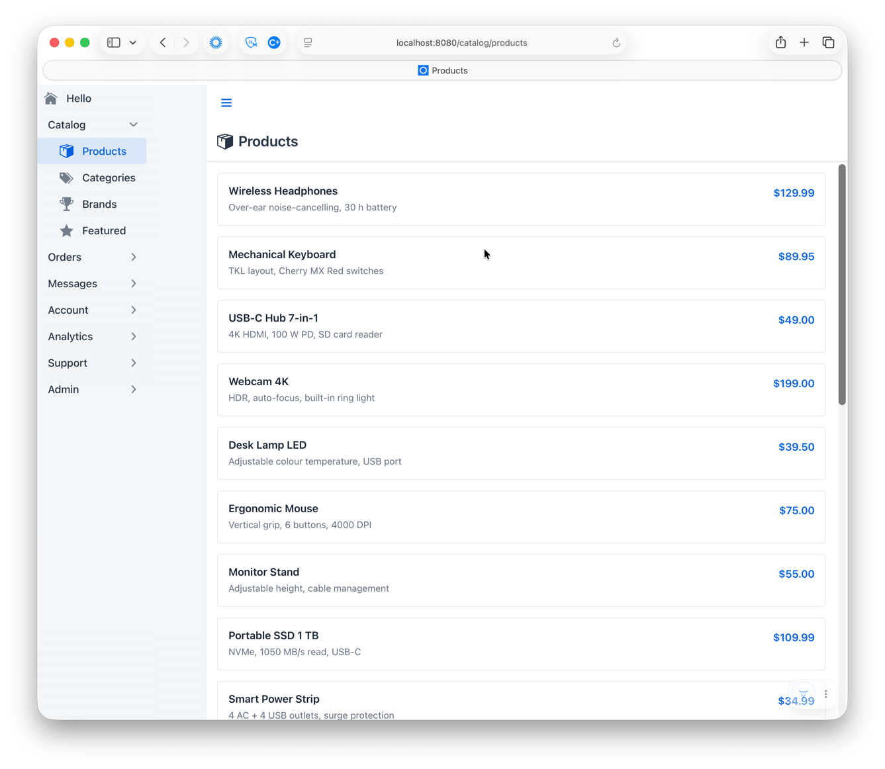
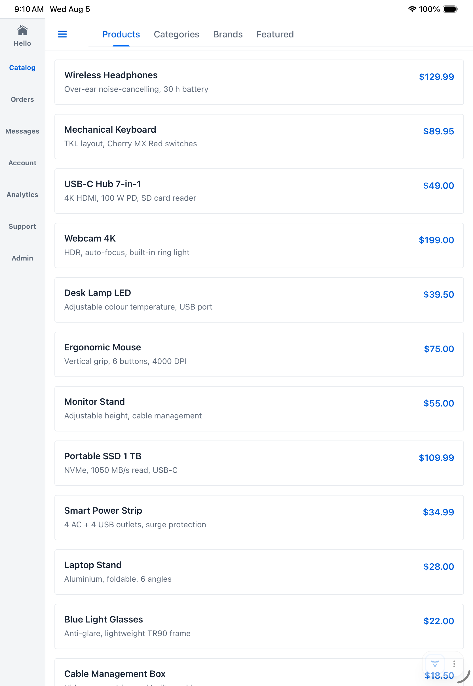
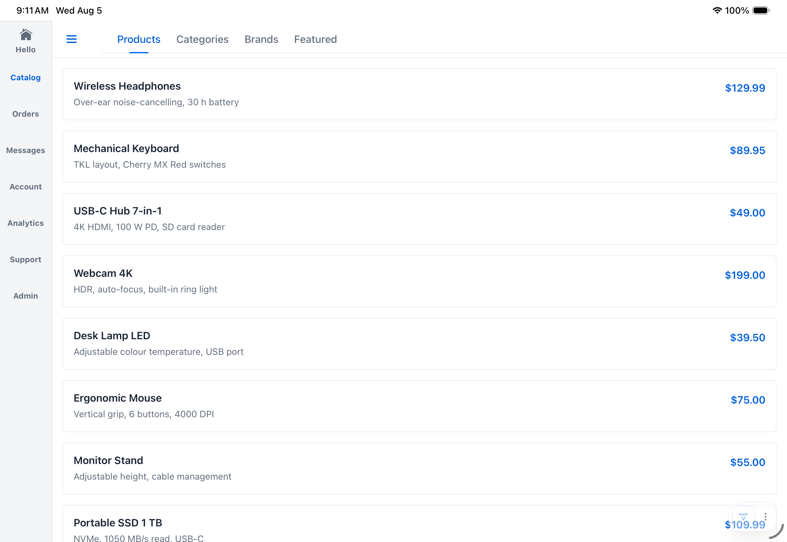
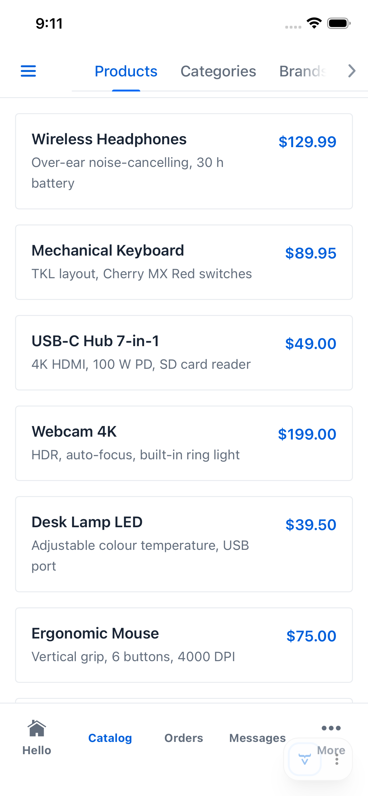
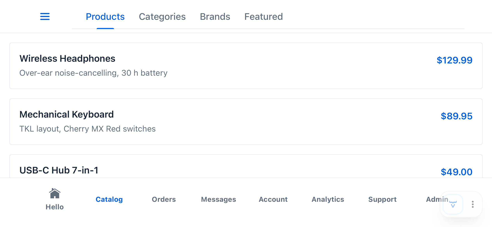

# AppNavLayout (vaadin-flow-app-nav-layout)

`AppNavLayout` is a mobile-friendly base layout for your Vaadin application. By default, it automatically generates your application's navigation menus from the `@Menu`, `@Route`, and `@PageTitle` annotations on your views. Out of the box, it uses a bottom touch bar on phones, a side rail on tablets, and a `SideNav` drawer on desktops. If you don't like any default, you can change it. For instance, if you prefer alternative titles, icons, or hierarchy than supplied by the defaults, you can provide your own replacement suppliers. And if need be, you can provide an entirely different menu system for any device/orientation combination.

## Table of Contents

- [Getting Started](#getting-started)
- [Features](#features)
- [How it works](#how-it-works)
- [Screenshots](#screenshots)
- [Customization](#customization)
- [Nav grouping](#nav-grouping)
- [View header integration](#view-header-integration)
- [API Reference](#api-reference)
- [Development](#development)
  - [Running the demo](#running-the-demo)
  - [Integration tests](#integration-tests)
- [Publishing to Vaadin Directory](#publishing-to-vaadin-directory)

## Getting Started

You can get started with `AppNavLayout` by extending it with an empty layout subclass, then layer on progressively richer configuration as your application needs it.

### Minimal setup

`AppNavLayout` has no abstract methods, so an empty layout subclass is all you need:

```java
@Layout
public class MainLayout extends AppNavLayout {
}
```

This alone builds a full nav tree from your `@Route`/`@Menu`-annotated views — one item per view, with siblings sharing a path segment grouped automatically. It renders as whichever chrome fits the device (a bottom touch bar on phone, a side rail on tablet, or a `SideNav` drawer on desktop), with the current route's item highlighted as you navigate.

### Menu icons and titles

Each nav item needs a label and wants an icon.

#### Default behavior

By default, `AppNavLayout` calls Vaadin's `MenuConfiguration.getMenuEntries()` to retrieve the labels and icons from each view's `@Menu` annotation. If a `@Menu` annotation doesn't supply a title, first the `@PageTitle` and then the view class name are used as fallbacks.

So the simplest possible setup is to add `@Menu` annotations to your views:

```java
@Route("catalog/products")
@Menu(title = "Products", icon = "vaadin:package")
public class ProductsView extends Div {
}
```

This produces a nav item with the label "Products" and the "package" icon from the `vaadin` icon set.

#### Supplying alternate icon and title generators

If your application has an alternative means of specifying view icons and titles (such as custom view annotations, an enum, or a map), wire `setViewIconGenerator`/`setViewTitleGenerator` to read them instead. Returning `null` for a given view falls back to the above default.

In the following example, each view carries its own custom `@ViewIcon` annotations and prioritizes `@PageTitle` over that of `@Menu`'s title:

```java
@Target(ElementType.TYPE)
@Retention(RetentionPolicy.RUNTIME)
public @interface ViewIcon {
    VaadinIcon value();
}
```

```java
@Route("catalog/products")
@Menu
@PageTitle("Products")
@ViewIcon(VaadinIcon.PACKAGE)
public class ProductsView extends Div {
}
```

`MainLayout` reads those annotations to drive the icon and title:

```java
@Layout
public class MainLayout extends AppNavLayout {

    public MainLayout() {

        setViewIconGenerator(m -> Optional.ofNullable(m.menuClass())
                .map(v -> v.getAnnotation(ViewIcon.class))
                .<Supplier<Icon>>map(a -> a.value()::create)
                .orElse(null));

        setViewTitleGenerator(m -> Optional.ofNullable(m.menuClass())
                .map(v -> v.getAnnotation(PageTitle.class))
                .map(PageTitle::value)
                .orElse(null));
    }
}
```

Each generator is called for every affected view whenever nav items are rebuilt — on every completed navigation, and, for the touch bar/rail, also whenever a resize or orientation change alters how many icons fit. It's safe to depend on state that can change over the layout's lifetime.

### Nav groups

Sibling views under the same route path prefix are naturally related — a nav group ties them together under one label.

#### Default behavior

No additional annotation is needed for basic grouping: views sharing the same `@Route` path prefix are grouped automatically, labeled with the final segment of the prefix. The group has no icon, since route path prefixes don't carry one.

```java
@Route("catalog/products")
@Menu(title = "Products", icon = "vaadin:package")
public class ProductsView extends Div {
}
```

```java
@Route("catalog/categories")
@Menu(title = "Categories", icon = "vaadin:tags")
public class CategoriesView extends Div {
}
```

This produces a "Catalog" group — labeled from the `catalog` path segment — containing "Products" and "Categories".

#### Supplying custom nav groups

To assign a view to a group explicitly, independent of its route path, or to give a group a title and icon, supply a `setViewNavGroupResolver` that returns a `NavGroup` identifying the view's group membership.

In the following example, each view carries its own custom `@MenuGroup` annotation:

```java
@Target(ElementType.TYPE)
@Retention(RetentionPolicy.RUNTIME)
public @interface MenuGroup {
    String title();
    VaadinIcon value();
}
```

```java
@Route("catalog/products")
@Menu(title = "Products", icon = "vaadin:package")
@MenuGroup(title = "Catalog", value = VaadinIcon.PACKAGE)
public class ProductsView extends Div {
}
```

`MainLayout` reads that annotation to build the group. `NavGroup` can't be implemented directly on an annotation (annotation elements can only be primitives, `String`, `Class`, enums, other annotations, or arrays of those), so it's built as an anonymous class from the annotation's values:

```java
@Layout
public class MainLayout extends AppNavLayout {

    public MainLayout() {

        setViewNavGroupResolver(m -> Optional.ofNullable(m.menuClass())
                .map(v -> v.getAnnotation(MenuGroup.class))
                .map(ann -> (NavGroup) new NavGroup() {
                    public String title() { return ann.title(); }
                    public Supplier<Icon> icon() { return ann.value()::create; }
                    public NavGroup parent() { return null; }
                })
                .orElse(null));
    }
}
```

Like the generators above, the resolver is called for every affected view whenever nav items are rebuilt, not once and cached.

A sibling view sharing the same first path segment but returning a `null` `NavGroup` merges into that same group automatically, picking up its title and icon too. See [Nav grouping](#nav-grouping) for the full grouping rules, including the ordering this merge depends on.

### Active-item highlighting

Touch/rail nav items need to know which one counts as "active" for the current route.

#### Default behavior

By default, `AppNavLayout` matches the current path against each nav item with `String::equals` — an item is active only on an exact match, so a parent item won't stay highlighted while a nested child route beneath it is active:

```java
@Route("catalog/products")
@Menu(title = "Products", icon = "vaadin:package")
public class ProductsView extends Div {
}
```

```java
@Route("catalog/products/detail")
public class ProductDetailView extends Div {
}
```

Navigating to `catalog/products/detail` leaves "Products" unhighlighted, since that path doesn't equal `catalog/products`.

#### Supplying a nav path matcher

To keep a parent item highlighted while its own nested routes are active, supply a `setNavPathMatcher` — the following highlights a nav item whenever the current path starts with its own path:

```java
@Layout
public class MainLayout extends AppNavLayout {

    public MainLayout() {

        setNavPathMatcher((currentPath, navItemPath) -> {
            var currentSegs = new Location(currentPath).getSegments();
            var navItemSegs = new Location(navItemPath).getSegments();
            return !navItemSegs.isEmpty()
                    && currentSegs.size() >= navItemSegs.size()
                    && currentSegs.subList(0, navItemSegs.size()).equals(navItemSegs);
        });
    }
}
```

### Supplying brand content

`addBranding(Component...)` places your own logo/title component in the brand area — the header on desktop, or the top of the drawer on mobile. Pass whatever fits your app: a heading, a logo image, or a composite of both; `AppNavLayout` doesn't presume a shape for it.

```java
@Layout
public class MainLayout extends AppNavLayout {

    public MainLayout(@Value("${spring.application.name:App}") String appName) {
        addBranding(new H1(appName));
    }
}
```

The `@Value` annotation here is Spring's own property injection, reading `spring.application.name` and falling back to `"App"` if it's unset — one convenient source for the name, not something `AppNavLayout` requires; any string (or component) works.

[Customization](#customization) covers what else can be overridden, and [API Reference](#api-reference) has the full setter/default listing.

## Features

### Automatic

- **Device-adaptive nav chrome** — a bottom touch bar on phones, a permanent side rail on tablets (both orientations), and a `SideNav` drawer on desktop, switched to automatically based on touch capability and screen size.
- **Live re-evaluation** — rotating a device, resizing a split-screen window, or any other viewport change re-picks the right nav type in place, with no page reload.
- **Nav tree derived from your routes** — the entire nav tree comes from the `@Route`/`@Menu` metadata your views already declare; add, move, or rename a view and every nav surface (bar, rail, drawer) picks it up with no separate wiring.
- **Automatic grouping** — sibling routes sharing a first path segment (e.g. `catalog/products`, `catalog/categories`) are grouped under an auto-labeled section with no group annotation of their own.
- **Overflow handling** — when more root sections exist than fit a touch bar or rail, the excess collapses into a "More" popover automatically.
- **Drill-down secondary nav** — nested routes get a two-level tab bar with a back button on touch/rail, kept in sync with the current route.
- **Active-item highlighting** — the current route's nav item is highlighted consistently across all three nav types.
- **Adaptive per-view header** — a view can contribute an icon+title (desktop) or an action component (desktop and mobile) to a header slot that reassembles itself on every navigation, via `HasViewHeaderTitle`/`HasViewHeaderComponent`.
- **Theme-adaptive styling** — active nav items pick up whichever Vaadin theme is actually loaded (Lumo, Aura, or a properly authored custom theme) automatically, rather than a hardcoded color.
- **Safe-area aware** — bar/rail icon capacity accounts for device notches, rounded corners, and home indicators, so nothing renders under an unsafe strip.

### Customizable

- **Custom icon/title/grouping** — drive labels, icons, and grouping from your own annotations instead of `@Menu`, via `setViewIconGenerator`/`setViewTitleGenerator`/`setViewNavGroupResolver`.
- **Custom grouping strategy** — replace `PathPrefixNavGrouper` entirely with your own `NavGrouper`.
- **Custom active-item matching** — override path matching (`setNavPathMatcher`) and nested-route match behavior (`setNavMatchNested`) for touch/rail highlighting.
- **Per-scenario renderers** — independently swap the `NavRenderer` for any of the five device/orientation scenarios, or set both orientations of tablet/phone at once.
- **Partial overrides** — subclass a built-in renderer to change just one behavior, e.g. `createOverflowComponent()` to replace the "More" popover with a chevron or swipeable strip.
- **Custom `SideNavItem` rendering** — override `setNavNodeRenderer` for full control of the desktop drawer's item appearance.
- **Configurable breakpoint** — adjust the physical-screen-size threshold that distinguishes tablet from phone (`setTabletMinShortSidePx`).
- **Lifecycle hook** — react to nav-type changes via `onNavTypeChanged`/`NavTypeChangedEvent`.
- **Escape hatch** — `addToNavbar()` for direct `AppLayout` access when nothing else fits.

## How it works

Building them by hand usually means maintaining three separate navigation components in sync with your routes, updated one by one whenever a view is added, moved, or renamed. `AppNavLayout` derives all three from the same `@Route`/`@Menu` metadata your views already declare, and switches between them live as the viewport changes — one navigation model, no per-device wiring to maintain.

`AppNavLayout` is a `Layout` subclass with no abstract methods, so the layout-side setup is just the class declaration itself:

```java
@Layout
public class MainLayout extends AppNavLayout {
}
```

Every adaptive nav component — touch bar, rail, side nav — is built and kept in sync from Vaadin's own `@Route`/`@Menu`-annotated views, the same metadata `MenuConfiguration` already exposes for any Vaadin router. A view's `@Menu` title, icon, and order become its label, icon, and position in whichever nav type is currently active, with no separate wiring per nav type:

```java
@Route("")
@Menu(title = "Home", icon = "vaadin:home", order = 1)
public class HomeView extends Div {
}
```

Grouping likewise falls directly out of the route structure: `PathPrefixNavGrouper`, the default `NavGrouper`, nests a view under whichever other view shares its first `@Route` path segment, labeling the group from that segment. A view routed at `catalog/products` therefore lands under an auto-labeled "Catalog" section alongside any sibling `catalog/...` view, without a group annotation of its own:

```java
@Route("catalog/products")
@Menu(title = "Products", order = 2)
public class ProductsView extends Div {
}
```

See [Screenshots](#screenshots) for what this produces on each device, and [Customization](#customization) for how each of these defaults can be overridden.

## Screenshots

<table>
<tr>
<td align="center" colspan="2">
<br>
<sub><b>Desktop</b> — <code>SIDENAV</code> drawer</sub>
</td>
</tr>
<tr>
<td align="center" width="40%">
<br>
<sub><b>Tablet, portrait</b> — <code>RAIL</code></sub>
</td>
<td align="center">
<br>
<sub><b>Tablet, landscape</b> — <code>RAIL</code></sub>
</td>
</tr>
<tr>
<td align="center">
<br>
<sub><b>Phone, portrait</b> — <code>TOUCH</code> bottom bar with secondary tabs, overflowing into a popover</sub>
</td>
<td align="center">
<br>
<sub><b>Phone, landscape</b> — <code>TOUCH</code> bottom bar, wide enough that nothing overflows</sub>
</td>
</tr>
</table>

## Customization

Every default can be overridden. For example, to drive icons, titles, and grouping from custom annotations instead of `@Menu`, and to customize active-item matching:

```java
@Layout
public class MainLayout extends AppNavLayout {

    public MainLayout(@Value("${spring.application.name:App}") String appName) {
        addBranding(new H1(appName));

        setViewIconGenerator(m -> Optional.ofNullable(m.menuClass())
                .map(v -> v.getAnnotation(ViewIcon.class))
                .<Supplier<Icon>>map(a -> a.value()::create)
                .orElse(null));

        setViewTitleGenerator(m -> Optional.ofNullable(m.menuClass())
                .map(v -> v.getAnnotation(PageTitle.class))
                .map(PageTitle::value)
                .orElse(null));

        setViewNavGroupResolver(m -> Optional.ofNullable(m.menuClass())
                .map(v -> v.getAnnotation(MenuGroup.class))
                .map(MenuGroup::value)
                .orElse(null));

        setNavPathMatcher((currentPath, navItemPath) -> {
            var currentSegs = new Location(currentPath).getSegments();
            var navItemSegs = new Location(navItemPath).getSegments();
            return !navItemSegs.isEmpty()
                    && currentSegs.size() >= navItemSegs.size()
                    && currentSegs.subList(0, navItemSegs.size()).equals(navItemSegs);
        });
    }
}
```

All configuration calls take effect immediately, even after the component is attached.

The component that renders each device/orientation scenario is equally replaceable, independent
of how the nav tree is grouped. Register a different implementation outright:

```java
setDesktopNavRenderer(MyCompanySideNavRenderer::new);
```

Which chrome gets built for a scenario (rail, bottom bar, or drawer) isn't a separate choice —
it's derived from whichever renderer is configured, via that renderer's own `navType()`. So
setting one renderer for both tablet orientations gives both orientations that renderer's
chrome, the same way phone already gets touch-bar chrome in both orientations by default (and
tablet already gets rail chrome in both orientations by default):

```java
setTabletNavRenderer(SideNavDrawerNavRenderer::new); // sidenav drawer in both tablet orientations, replacing the rail default
```

or subclass one of the built-ins to change just one piece of its behavior — for example, the
phone touch bar's overflow presentation:

```java
setPhoneNavRenderer(() -> new TouchBarNavRenderer() {
    @Override
    protected Component createOverflowComponent(List<MenuEntry> overflowEntries,
            Button overflowTrigger, Map<NavNode, Button> overflowButtonsOut) {
        return myChevronExpandComponent(overflowEntries, overflowTrigger, overflowButtonsOut);
    }
});
```

See [API Reference](#api-reference) for `NavRenderer`, `NavRenderContext`, and `NavSlots`.

## Nav grouping

`NavGrouper` is a `@FunctionalInterface` with a single method `NavNode nodeFor(MenuEntry)`. It maps each route entry to its position in the nav tree via `NavNode` parent links.

The default implementation, `PathPrefixNavGrouper`, groups routes by their first URL path segment. When a `NavGroup` resolver is also configured (via `setViewNavGroupResolver`), pre-warming entries with explicit groups causes their path siblings to merge into the same group automatically.

To use a fully custom grouping strategy, implement `NavGrouper` and pass it to `setNavGrouper()`.

## View header integration

Views can contribute content to the adaptive header slot without coupling to layout internals:

**`HasViewHeaderTitle`** — contributes an icon + title row (desktop only). Override `getViewHeaderIcon()` to supply an `Icon`; the `@PageTitle` value is read automatically. Override `getViewHeaderSuffix()` to append a badge or other trailing component.

**`HasViewHeaderComponent`** — contributes an action component shown on both desktop and mobile (e.g., a search bar or toolbar).

Both interfaces provide no-op defaults; implement only what is needed.

## API Reference

Every public and protected member of the library, for lookup. All `AppNavLayout` configuration setters take effect immediately, even after the component is attached.

#### `AppNavLayout`

Constructors (protected — called via `super(...)` from a subclass):

| Constructor                     | Description                                                                    |
|---------------------------------|--------------------------------------------------------------------------------|
| `AppNavLayout()`                | Empty app title, default renderers for every scenario.                         |
| `AppNavLayout(String appTitle)` | Given app title (empty string for none), default renderers for every scenario. |

Configuration setters (protected — call from the subclass constructor or later):

| Method                                                        | Default                | Description                                                                                                                                                                        |
|---------------------------------------------------------------|------------------------|------------------------------------------------------------------------------------------------------------------------------------------------------------------------------------|
| `addBrandContent(Component...)`                               | —                      | Logo/title: header (desktop) or drawer top (mobile). Pass individual components, not pre-wrapped.                                                                                  |
| `setUserMenu(Component)`                                      | —                      | User widget: header trailing (desktop) or drawer bottom (mobile).                                                                                                                  |
| `setNavPathMatcher(BiPredicate<String, String>)`              | `String::equals`       | Active-item path matching for touch/rail highlighting only — desktop `SideNav` highlights via Vaadin's own router matching.                                                        |
| `setNavMatchNested(boolean)`                                  | `false`                | Whether desktop `SideNavItem`s use `setMatchNested`, so a parent stays highlighted while any child route is active.                                                                |
| `setNavGrouper(NavGrouper)`                                   | `PathPrefixNavGrouper` | Full grouping strategy override. **Severs** the automatic wiring to `setViewNavGroupResolver`/`setViewIconGenerator` — configure a custom grouper directly before passing it here. |
| `setNavNodeRenderer(ComponentRenderer<SideNavItem, NavNode>)` | built-in               | Custom desktop `SideNavItem` renderer.                                                                                                                                             |
| `setViewNavGroupResolver(Function<MenuEntry, NavGroup>)`      | path-based (`null`)    | Explicit group assignment for a view; return `null` for path-based grouping. Only takes effect through the default `PathPrefixNavGrouper`.                                         |
| `setViewIconGenerator(Function<MenuEntry, Supplier<Icon>>)`   | no icon                | Icon for each leaf nav item. Only takes effect through the default `PathPrefixNavGrouper`.                                                                                         |
| `setViewTitleGenerator(Function<MenuEntry, String>)`          | `@Menu#title()`        | Label for desktop `SideNavItem`s only — touch/rail labels always use `NavNode.title()`.                                                                                            |

`NavRenderer` setters (protected — call from the subclass constructor or later): each takes a
`Supplier<NavRenderer>`, invoked at most once — the first time that scenario is actually needed,
not eagerly. If the scenario is currently active, it's torn down and rebuilt immediately.

| Method                                                 | Default                          | Description                                                                                                                                                                                                                                |
|--------------------------------------------------------|----------------------------------|--------------------------------------------------------------------------------------------------------------------------------------------------------------------------------------------------------------------------------------------|
| `setDesktopNavRenderer(Supplier<NavRenderer>)`         | `SideNavDrawerNavRenderer::new`  | Renderer for the desktop scenario.                                                                                                                                                                                                         |
| `setTabletPortraitNavRenderer(Supplier<NavRenderer>)`  | `SideRailNavRenderer::new`       | Renderer for the portrait-tablet scenario.                                                                                                                                                                                                 |
| `setTabletLandscapeNavRenderer(Supplier<NavRenderer>)` | same instance as portrait-tablet | Renderer for the landscape-tablet scenario.                                                                                                                                                                                                |
| `setTabletNavRenderer(Supplier<NavRenderer>)`          | —                                | Convenience: sets both tablet orientations to one shared, memoized instance. Both orientations get that renderer's own chrome (its `navType()`), so e.g. supplying `SideRailNavRenderer` correctly gives rail chrome in both orientations. |
| `setPhonePortraitNavRenderer(Supplier<NavRenderer>)`   | `TouchBarNavRenderer::new`       | Renderer for the portrait-phone scenario.                                                                                                                                                                                                  |
| `setPhoneLandscapeNavRenderer(Supplier<NavRenderer>)`  | same instance as portrait-phone  | Renderer for the landscape-phone scenario.                                                                                                                                                                                                 |
| `setPhoneNavRenderer(Supplier<NavRenderer>)`           | —                                | Convenience: sets both phone orientations to one shared, memoized instance — the correct default relationship for phone, since both orientations already resolve to the same `NavType` and slot.                                           |

Public fluent setters (each returns `this`):

| Method                            | Default | Description                                                                                                                                                                                                                     |
|-----------------------------------|---------|---------------------------------------------------------------------------------------------------------------------------------------------------------------------------------------------------------------------------------|
| `setTabletMinShortSidePx(int px)` | `768`   | Physical-screen-shorter-side threshold (CSS px) distinguishing `TABLET` from `PHONE` among touch devices. Re-evaluates device type and nav type immediately if already attached. Throws `IllegalArgumentException` if negative. |
| `setAppTitle(String)`             | —       | Updates the title returned by `getAppTitle()`.                                                                                                                                                                                  |

Lifecycle hooks and events:

| Member                                                                   | Description                                                                                                                                                                                                                                                  |
|--------------------------------------------------------------------------|--------------------------------------------------------------------------------------------------------------------------------------------------------------------------------------------------------------------------------------------------------------|
| `onNavTypeChanged(NavTypeChangedEvent event)`                            | Protected, no-op by default. Override to react to nav-type determination, including the first attachment.                                                                                                                                                    |
| `addNavTypeChangedListener(ComponentEventListener<NavTypeChangedEvent>)` | Public, returns a `Registration`. For non-subclass consumers of the same event.                                                                                                                                                                              |
| `afterNavigation(AfterNavigationEvent event)`                            | Public, from `AfterNavigationObserver`. Rebuilds the adaptive view header from the current view's `HasViewHeaderTitle`/`HasViewHeaderComponent`, and re-invokes the active `NavRenderer`(s) so active-item highlighting and drill-down content stay current. |

Accessors and escape hatch:

| Member                      | Description                                                                                                                                                                                           |
|-----------------------------|-------------------------------------------------------------------------------------------------------------------------------------------------------------------------------------------------------|
| `getAppTitle()`             | Protected. Returns the app title supplied by the subclass.                                                                                                                                            |
| `isMobile()`                | Protected. `true` for touch/rail nav, `false` for desktop `SIDENAV` — and `false` before the first `onAttach()` completes (device detection isn't ready yet). Don't call from a subclass constructor. |
| `addToNavbar(Component...)` | Public, overrides `AppLayout`. Appends directly to the top bar row; prefer the named adaptive methods above.                                                                                          |

#### `NavTypeChangedEvent`

Fired whenever `AppNavLayout` determines and applies a `NavType`, including on first attachment.

| Method                   | Description                                                       |
|--------------------------|-------------------------------------------------------------------|
| `getNavType()`           | The newly applied nav type.                                       |
| `getPreviousNavType()`   | The previously active nav type, or `null` on first attachment.    |
| `isInitialApplication()` | `true` if this is the first nav type ever applied to this layout. |

#### `NavRenderer`

Builds and updates the nav-item content for one of the five device/orientation scenarios
(desktop, tablet portrait, tablet landscape, phone portrait, phone landscape), placing it into
whichever of `AppNavLayout`'s named locations (see `NavSlots`) is appropriate. Deliberately
decoupled from nav organization: a renderer receives an already-configured `NavGrouper` and
never influences or queries how the tree is grouped.

| Method                             | Description                                                                                                                                                                                                                                                                                                                                                                                               |
|------------------------------------|-----------------------------------------------------------------------------------------------------------------------------------------------------------------------------------------------------------------------------------------------------------------------------------------------------------------------------------------------------------------------------------------------------------|
| `render(NavRenderContext context)` | Builds or updates this renderer's content for the current nav state. Called once when this scenario becomes active, again on every completed navigation, and again whenever nav configuration changes (grouper swap, path matcher change). Decides which slot(s) to populate and how — including any overflow/drill-down scaffolding it needs (a "More…" popover, a chevron, a swipeable container, etc). |
| `navType()`                        | The chrome this renderer requires (`SIDENAV`, `RAIL`, or `TOUCH`) — determines which `NavStrategy` gets built for whichever scenario this renderer is configured for. Not a free choice: a renderer's `render()` already assumes one specific `NavSlots` accessor is live, and that slot is only live under the matching `NavType`'s strategy.                                                            |

#### `NavRenderContext`

Passed to `NavRenderer.render(...)`.

| Method          | Description                                                        |
|-----------------|--------------------------------------------------------------------|
| `navGrouper()`  | The current nav grouping strategy.                                 |
| `currentPath()` | The path of the currently active navigation, leading `/` stripped. |
| `slots()`       | The full set of named locations available to render into.          |

#### `NavSlots`

`AppNavLayout`'s whole shape, exposed identically to every renderer regardless of scenario — a
renderer sees all four locations and decides for itself which are relevant to it.

| Method        | Description                                                                                                                                                                          |
|---------------|--------------------------------------------------------------------------------------------------------------------------------------------------------------------------------------|
| `drawer()`    | Desktop nav location, inside the drawer.                                                                                                                                             |
| `sideRail()`  | Tablet nav location (both orientations), the left-edge rail.                                                                                                                         |
| `touchBar()`  | Phone nav location, the bottom bar.                                                                                                                                                  |
| `headerNav()` | Shared drill-down location for nested routes, alongside `sideRail()`/`touchBar()`. Distinct from the per-view header slot (see [View header integration](#view-header-integration)). |

#### `SideNavDrawerNavRenderer`

Default `NavRenderer` for the desktop scenario — builds a full `SideNav` hierarchy into
`NavSlots.drawer()`, honoring `setNavNodeRenderer`/`setNavMatchNested`. Public no-arg constructor.

#### `SideRailNavRenderer` / `TouchBarNavRenderer`

Default `NavRenderer`s for the tablet (both orientations) and phone scenarios respectively: a
primary icon bar (rail or bottom bar) with a "More" overflow `Popover` when more root sections
exist than fit, plus a shared two-level drill-down bar in `NavSlots.headerNav()`. Both public,
no-arg constructors, sharing their implementation internally.

| Method                                                                                                                      | Description                                                                                                                                                                                                                                                                                                                                                                       |
|-----------------------------------------------------------------------------------------------------------------------------|-----------------------------------------------------------------------------------------------------------------------------------------------------------------------------------------------------------------------------------------------------------------------------------------------------------------------------------------------------------------------------------|
| `createOverflowComponent(List<MenuEntry> overflowEntries, Button overflowTrigger, Map<NavNode, Button> overflowButtonsOut)` | Protected. Default: a `Popover` listing the overflowing entries. Override in a subclass to replace the overflow presentation (e.g. an expand chevron or a swipeable strip) while keeping bar layout, active highlighting, and header-nav delegation unchanged. Populate `overflowButtonsOut` the same way if the "More" item should highlight while one of its entries is active. |

#### `NavGrouper` (`@FunctionalInterface`)

| Member                             | Description                                                                                                                                                                                                                                          |
|------------------------------------|------------------------------------------------------------------------------------------------------------------------------------------------------------------------------------------------------------------------------------------------------|
| `NavNode nodeFor(MenuEntry entry)` | Maps a route entry to its `NavNode` in the nav tree. **Must be idempotent** — called on both the initial build and every subsequent navigation, so implementations must not mutate state on first call. Call order across entries is not guaranteed. |
| `default void reset()`             | No-op by default. Clears cached state so the next `nodeFor` calls start fresh.                                                                                                                                                                       |

#### `PathPrefixNavGrouper` (the default `NavGrouper`)

Derives the nav hierarchy from `@Route` path segments.

| Method                                                      | Description                                                                                                                                                                                      |
|-------------------------------------------------------------|--------------------------------------------------------------------------------------------------------------------------------------------------------------------------------------------------|
| `setNavGroupDefResolver(Function<MenuEntry, NavGroup>)`     | Returns `this`. Maps an entry to explicit `NavGroup` metadata; return `null` to fall back to path-based grouping.                                                                                |
| `setViewIconGenerator(Function<MenuEntry, Supplier<Icon>>)` | Returns `this`. Icon generator for leaf nodes; default is no icon.                                                                                                                               |
| `reset()`                                                   | Clears all cached group/leaf nodes.                                                                                                                                                              |
| `nodeFor(MenuEntry)`                                        | Path-based grouping: entries sharing a first path segment share a group, auto-labeled from that segment (`RouteNavUtils.routeSegmentLabel`) unless a `NavGroup` resolver assigns one explicitly. |

#### `NavGroup`

Implement to declare explicit group metadata (title/icon/parent), paired with `AppNavLayout.setViewNavGroupResolver`.

| Method     | Description                                                                                                                                                                   |
|------------|-------------------------------------------------------------------------------------------------------------------------------------------------------------------------------|
| `title()`  | Display title for this group node.                                                                                                                                            |
| `icon()`   | Returns a `Supplier<Icon>` for the group icon, or `null` for none. Each invocation must produce a **new** `Icon` instance — a cached instance gets silently moved on rebuild. |
| `parent()` | The parent group, or `null` for a root group.                                                                                                                                 |

#### `NavNode`

Immutable nav-tree node — a group (no `menuEntry()`) or a leaf (`menuEntry()` present).

| Method                                                                            | Description                                                                              |
|-----------------------------------------------------------------------------------|------------------------------------------------------------------------------------------|
| `static NavNode of(String title, Supplier<Icon> iconSupplier)`                    | Root group node.                                                                         |
| `static NavNode of(String title, Supplier<Icon> iconSupplier, NavNode parent)`    | Group node nested under `parent`.                                                        |
| `static NavNode of(MenuEntry entry)`                                              | Root leaf node; icon from `@Menu(icon=...)`.                                             |
| `static NavNode of(MenuEntry entry, Supplier<Icon> iconOverride)`                 | Root leaf node; `iconOverride` wins over `@Menu(icon=...)` if non-null.                  |
| `static NavNode of(MenuEntry entry, NavNode parent)`                              | Leaf node nested under `parent`; icon from `@Menu(icon=...)`.                            |
| `static NavNode of(MenuEntry entry, Supplier<Icon> iconOverride, NavNode parent)` | Leaf node nested under `parent`; `iconOverride` wins over `@Menu(icon=...)` if non-null. |
| `title()`                                                                         | Display title for this node.                                                             |
| `createIcon()`                                                                    | Returns a fresh `Optional<Icon>` — a new instance on every call; never cache the result. |
| `parent()`                                                                        | `Optional<NavNode>` — empty for top-level nodes.                                         |
| `menuEntry()`                                                                     | `Optional<MenuEntry>` — present for leaves, empty for groups.                            |

#### `RouteNavUtils`

Stateless static helpers.

| Method                              | Description                                                                                                                  |
|-------------------------------------|------------------------------------------------------------------------------------------------------------------------------|
| `pathSegments(String routePath)`    | Path segments as an immutable list; empty path (e.g. root `""`) returns `List.of()`, not a list containing one empty string. |
| `normalizedPath(MenuEntry entry)`   | `entry.path()` with any leading `/` stripped.                                                                                |
| `routeSegmentLabel(String segment)` | Capitalizes each hyphen-delimited word, e.g. `"audit-log"` → `"Audit Log"`.                                                  |
| `leafTitle(MenuEntry entry)`        | `entry.title()` as-is — already resolved by `MenuConfiguration.getMenuEntries()` (`@Menu` title, falling back to `@PageTitle`, then the class name); adds no fallback of its own. |

#### `NavType`, `DeviceType`, `Orientation` (enums)

| Type          | Constants                                                                                                                                                                                                      |
|---------------|----------------------------------------------------------------------------------------------------------------------------------------------------------------------------------------------------------------|
| `NavType`     | `TOUCH` — touch bottom bar + secondary tabs. `RAIL` — permanent left-strip icon rail. `SIDENAV` — drawer-based `SideNav`. Declared by the active scenario's `NavRenderer.navType()`, not chosen independently. |
| `DeviceType`  | `PHONE`, `TABLET`, `DESKTOP` — detected from touch capability and screen size. Defaults to `DESKTOP` before the async client round-trip completes, and for any non-touch device.                               |
| `Orientation` | `PORTRAIT`, `LANDSCAPE` — re-evaluated on window resize for touch devices. Defaults to `LANDSCAPE` before the client round-trip completes.                                                                     |

#### `HasViewHeaderTitle`

Implement on a view to contribute an auto-generated icon+title component to the adaptive header (desktop only).

| Method                                    | Description                                                                                                                                                             |
|-------------------------------------------|-------------------------------------------------------------------------------------------------------------------------------------------------------------------------|
| `default Component getViewHeaderSuffix()` | `null` by default. Trailing component after the title (e.g. a badge); return a new instance on every navigation.                                                        |
| `default Icon getViewHeaderIcon()`        | `null` by default. Must return a **new** `Icon` instance on every call — a cached one gets silently moved on each navigation.                                           |
| `default Component getViewHeaderTitle()`  | Composes icon + `@PageTitle` + suffix into the header title component; called on every navigation. Override to replace it entirely; return `null` to suppress the slot. |

#### `HasViewHeaderComponent`

Implement on a view to contribute an action component to the adaptive header (both desktop and mobile).

| Method                               | Description                                                                                                                                                 |
|--------------------------------------|-------------------------------------------------------------------------------------------------------------------------------------------------------------|
| `Component getViewHeaderComponent()` | Called on every navigation. Return `null` to suppress the slot; return the same instance if it's already attached elsewhere, otherwise a new one each call. |

## Development

### Running the demo

```
mvn jetty:run
```

Starts the test/demo server at http://localhost:8080.

### Integration tests

```
mvn verify -Pit
```

Tests run in headless mode by default. To disable headless mode:

```
mvn verify -Pit -Dplaywright.headed=true
```

## Publishing to Vaadin Directory

You can create the zip package needed for [Vaadin Directory](https://vaadin.com/directory/) using

```
mvn versions:set -DnewVersion=1.0.0 # You cannot publish snapshot versions
mvn clean package -Pdirectory
```

The package is created as `target/{project-name}-1.0.0.zip`

For more information or to upload the package, visit https://vaadin.com/directory/my-components?uploadNewComponent
