# AppNavLayout (vaadin-flow-app-nav-layout)

`AppNavLayout` is a mobile-friendly base layout for your Vaadin application. By default, it automatically generates your application's navigation menus from the `@Menu`, `@Route`, and `@PageTitle` annotations on your views. Out of the box, it uses a bottom touch bar on phones, a side rail on tablets, and a `SideNav` drawer on desktops. If you don't like any default, you can change it. For instance, if you prefer alternative titles, icons, or hierarchy than supplied by the defaults, you can provide your own replacement suppliers. And if need be, you can provide an entirely different menu system for any device/orientation combination.

## Table of Contents

- [Usage](#usage)
- [What does it look like?](#what-does-it-look-like)
- [How it works](#how-it-works)
- [Feature list](#feature-list)
- [API Reference](#api-reference)
- [Add-On development](#add-on-development)
  - [Running the demo](#running-the-demo)
  - [Integration tests](#integration-tests)
- [Publishing to Vaadin Directory](#publishing-to-vaadin-directory)

## Usage

You can get started with `AppNavLayout` by extending it with an empty layout subclass, then layer on progressively richer configuration as your application needs it.

### Getting Started

`AppNavLayout` has no abstract methods, so an empty layout subclass is all you need:

```java
@Layout
public class MainLayout extends AppNavLayout {
}
```

This alone builds a full nav tree from your `@Route`/`@Menu`-annotated views — one item per view, with siblings sharing a path segment grouped automatically. It renders as whichever chrome fits the device (a bottom touch bar on phone, a side rail on tablet, or a `SideNav` drawer on desktop), with the current route's item highlighted as you navigate.

### Menu icons and titles

Each nav item needs a label and wants an icon.

#### Default behavior

By default, `AppNavLayout` calls Vaadin's `MenuConfiguration.getMenuEntries()` to retrieve the labels, icons, and order from each view's `@Menu` annotation. If a `@Menu` annotation doesn't supply a title, first the `@PageTitle` and then the view class name are used as fallbacks.

So the simplest possible setup is to supply title and icon values to the `@Menu` annotations of your views:

```java
@Route("catalog/products")
@Menu(title = "Products", icon = "vaadin:package", order = 2.1)
public class ProductsView extends Div {
}
```

This produces a nav item with the title "Products" and the "package" icon from the `vaadin` icon set.

#### Supplying alternative icon and title generators

If your application has an alternative means of specifying view icons and titles (such as custom view annotations, an enum, or a map), wire `setViewIconGenerator`/`setViewTitleGenerator` to read them instead. Returning `null` for a given view falls back to the above default.

In the following example, each view carries its own custom `@ViewIcon` annotation and prioritizes `@PageTitle` over that of the `@Menu`'s title:

```java
@Target(ElementType.TYPE)
@Retention(RetentionPolicy.RUNTIME)
public @interface ViewIcon {
    VaadinIcon value();
}
```

```java
@Route("catalog/products")
@Menu(order = 2.1)
@PageTitle("Products")
@ViewIcon(VaadinIcon.PACKAGE)
public class ProductsView extends Div {
}
```

`MainLayout` reads those annotations to drive the icon and title:

```java
@Layout
public class MainLayout extends AppNavLayout {

    public MainLayout() {

        setViewIconGenerator(m -> Optional.ofNullable(m.menuClass())
                .map(v -> v.getAnnotation(ViewIcon.class))
                .<Supplier<Icon>>map(a -> a.value()::create)
                .orElse(null));

        setViewTitleGenerator(m -> Optional.ofNullable(m.menuClass())
                .map(v -> v.getAnnotation(PageTitle.class))
                .map(PageTitle::value)
                .orElse(null));
    }
}
```

Each generator is called for every affected view whenever nav items are rebuilt — on every completed navigation, and, for the touch bar/rail, also whenever a resize or orientation change alters how many icons fit. It's safe to depend on state that can change over the layout's lifetime.

### Nav item and group order

`@Menu`'s `order` attribute controls where a nav item appears, ascending by value; entries that don't specify one sort after all that do, tie-broken by route path. `AppNavLayout` doesn't compute or override this — `MenuConfiguration.getMenuEntries()` already returns entries in that order, and every renderer (`SideNav` drawer, touch bar, side rail) just places items in the sequence it receives them.

```java
@Route("catalog/products")
@Menu(title = "Products", icon = "vaadin:package", order = 2.1)
public class ProductsView extends Div {
}
```

```java
@Route("catalog/categories")
@Menu(title = "Categories", icon = "vaadin:tags", order = 2.2)
public class CategoriesView extends Div {
}
```

A group's position follows the same rule, but through whichever member is encountered first — not a value of its own. The "Catalog" group these two views merge into (see [Nav groups](#nav-groups)) sorts at `2.1`, from `ProductsView`, the lower of the two; giving `CategoriesView` the lower order instead would move the whole group there. To place a group deliberately, give its intended anchor view the order value you want the group itself to sort at.

### Active-item highlighting

Touch/rail nav items need to know which one counts as "active" for the current route. This comes into play when the current route is a nested route beneath a parent nav item. In that situation, the parent item can be highlighted when its nested route is active.

#### Default behavior

By default, `AppNavLayout` matches the current path against each nav item with `String::equals` — an item is active only on an exact match, so a parent item won't be highlighted while a nested child route beneath it is active:

```java
@Route("catalog/products")
@Menu(title = "Products", icon = "vaadin:package", order = 2.1)
public class ProductsView extends Div {
}
```

```java
@Route("catalog/products/detail")
public class ProductDetailView extends Div {
}
```

Navigating to `catalog/products/detail` leaves "Products" unhighlighted, since that path doesn't equal `catalog/products`.

#### Supplying a nav path matcher

To keep a parent item highlighted while its own nested routes are active, supply a matcher via `setNavPathMatcher` — the following example highlights a nav item whenever the current path starts with its own path:

```java
@Layout
public class MainLayout extends AppNavLayout {

    public MainLayout() {

        setNavPathMatcher((currentPath, navItemPath) -> {
            var currentSegs = new Location(currentPath).getSegments();
            var navItemSegs = new Location(navItemPath).getSegments();
            return !navItemSegs.isEmpty()
                    && currentSegs.size() >= navItemSegs.size()
                    && currentSegs.subList(0, navItemSegs.size()).equals(navItemSegs);
        });
    }
}
```

### Nav groups

Sibling views under the same route path prefix are naturally related — a nav group ties them together under one label.

#### Default behavior

No additional annotation is needed for basic grouping — views sharing the same `@Route` path prefix are grouped automatically, labeled with the final segment of the prefix. The group has no icon, since route path prefixes don't carry them.

```java
@Route("catalog/products")
@Menu(title = "Products", icon = "vaadin:package", order = 2.1)
public class ProductsView extends Div {
}
```

```java
@Route("catalog/categories")
@Menu(title = "Categories", icon = "vaadin:tags", order = 2.2)
public class CategoriesView extends Div {
}
```

This produces a "Catalog" group — labeled from the `catalog` path segment — containing "Products" and "Categories".

#### Supplying custom nav groups

To assign a view to a group explicitly, independent of its route path, or to give a group a title and icon, supply a `setViewNavGroupResolver` that returns a `NavGroup` identifying the view's group membership.

##### By view class

In the following example, each view carries its own custom `@MenuGroupIcon` annotation to add an icon to its group; `title` is optional and falls back to the path-derived label when omitted:

```java
@Target(ElementType.TYPE)
@Retention(RetentionPolicy.RUNTIME)
public @interface MenuGroupIcon {
    VaadinIcon value();
    String title() default "";
}
```

```java
@Route("catalog/products")
@Menu(title = "Products", icon = "vaadin:package", order = 2.1)
@MenuGroupIcon(VaadinIcon.PACKAGE)
public class ProductsView extends Div {
}
```

`MainLayout` reads that annotation to build the group, falling back to the path-derived label when `title()` is blank. `NavGroup` can't be implemented directly on an annotation (annotation elements can only be primitives, `String`, `Class`, enums, other annotations, or arrays of those), so it's built as an anonymous class from the annotation's values:

```java
@Layout
public class MainLayout extends AppNavLayout {

    public MainLayout() {

        setViewNavGroupResolver(m -> Optional.ofNullable(m.menuClass())
                .map(v -> v.getAnnotation(MenuGroupIcon.class))
                .map(ann -> (NavGroup) new NavGroup() {
                    public String title() {
                        return !ann.title().isEmpty() ? ann.title()
                                : RouteNavUtils.routeSegmentLabel(RouteNavUtils.pathSegments(m.path()).getFirst());
                    }
                    public Supplier<Icon> icon() { return ann.value()::create; }
                    public NavGroup parent() { return null; }
                })
                .orElse(null));
    }
}
```

Like the generators above, the resolver is called for every affected view whenever nav items are rebuilt, not once and cached.

A sibling view sharing the same first path segment but returning a `null` `NavGroup` merges into that same group automatically, picking up its title and icon too. This works because `AppNavLayout` pre-warms every `NavGroup`-assigned entry first, before populating the rest of the tree, so by the time a path-based sibling is processed its `NavGroup`-derived parent already exists to merge into.

Two sibling views that each carry their own `@MenuGroupIcon` merge the same way, as long as their resolved titles match — group identity is based on title (and parent), not on the resolved `NavGroup` object itself, so it doesn't matter that each resolver call builds its own instance. Falling back to the path-derived label when `title` is omitted makes that automatic: siblings under the same path segment always derive the same fallback title, so an icon-only `@MenuGroupIcon` can never cause a merge to split. Overriding the title explicitly reintroduces the risk — a typo on one sibling (`"Catalog"` vs. `"Catalogue"`) splits the group in two — and an icon mismatch between otherwise-matching siblings merges silently, keeping whichever sibling's icon was resolved first.

##### By package (a better approach)

Repeating `@MenuGroupIcon` on every sibling view still risks that icon (or title override) drifting between copies, even though an omitted title can no longer cause it. Since the annotation only needs to be read once per group, add `ElementType.PACKAGE` to its `@Target` and place it on the package instead, via `package-info.java` (this assumes the group's views are organized by package):

```java
@Target({ElementType.TYPE, ElementType.PACKAGE})
@Retention(RetentionPolicy.RUNTIME)
public @interface MenuGroupIcon {
    VaadinIcon value();
    String title() default "";
}
```

```java
@MenuGroupIcon(VaadinIcon.PACKAGE)
package com.example.application.ui.view.catalog;

import com.example.application.ui.nav.MenuGroupIcon;
import com.vaadin.flow.component.icon.VaadinIcon;
```

Sibling views under that package then no longer need to carry the `@MenuGroupIcon` annotation themselves:

```java
@Route("catalog/products")
@Menu(title = "Products", icon = "vaadin:package", order = 2.1)
public class ProductsView extends Div {
}
```

```java
@Route("catalog/categories")
@Menu(title = "Categories", icon = "vaadin:tags", order = 2.2)
public class CategoriesView extends Div {
}
```

The resolver changes to match, reading the annotation from the view's package instead of the view class itself:

```java
@Layout
public class MainLayout extends AppNavLayout {

    public MainLayout() {

        setViewNavGroupResolver(m -> Optional.ofNullable(m.menuClass())
                .map(Class::getPackage)
                .map(p -> p.getAnnotation(MenuGroupIcon.class))
                .map(ann -> (NavGroup) new NavGroup() {
                    public String title() {
                        return !ann.title().isEmpty() ? ann.title()
                                : RouteNavUtils.routeSegmentLabel(RouteNavUtils.pathSegments(m.path()).getFirst());
                    }
                    public Supplier<Icon> icon() { return ann.value()::create; }
                    public NavGroup parent() { return null; }
                })
                .orElse(null));
    }
}
```

### Replacing the grouping strategy entirely

The two subsections above only customize `PathPrefixNavGrouper`, the default `NavGrouper` — they don't replace it. To use a completely different grouping algorithm, implement `NavGrouper` yourself and pass it to `setNavGrouper()`. `NavGrouper` is a `@FunctionalInterface` with one method, `NavNode nodeFor(MenuEntry)`, which maps each route entry to its position in the nav tree.

In the following example, views are grouped by their Java package instead of by route path segment:

```java
public class PackageNavGrouper implements NavGrouper {

    private final Map<Package, NavNode> groups = new HashMap<>();

    @Override
    public NavNode nodeFor(MenuEntry entry) {
        var pkg = entry.menuClass().getPackage();
        var group = groups.computeIfAbsent(pkg, p -> NavNode.of(RouteNavUtils.routeSegmentLabel(shortName(p)), null));
        return NavNode.of(entry, group);
    }

    private static String shortName(Package pkg) {
        var name = pkg.getName();
        return name.contains(".") ? name.substring(name.lastIndexOf('.') + 1) : name;
    }
}
```

```java
@Layout
public class MainLayout extends AppNavLayout {

    public MainLayout() {
        setNavGrouper(new PackageNavGrouper());
    }
}
```

### Nav renderers

Which chrome a scenario gets (drawer, bottom bar, rail, or header tab strip) comes from whichever `NavRenderer` is configured for it, not from a separate choice.

#### Default behavior

Desktop defaults to `SideNavDrawerNavRenderer`; tablet, both orientations, defaults to `SideRailNavRenderer`; phone, both orientations, defaults to `TouchBarNavRenderer`. No configuration is needed to get this — see [How it works](#how-it-works) for how the scenario itself is resolved.

#### Supplying a custom nav renderer

Register a different implementation outright:

```java
setDesktopNavRenderer(MyCompanySideNavRenderer::new);
```

Which chrome gets built for a scenario isn't a separate choice from the renderer — it's derived from that renderer's own `navType()`. So setting one renderer for both tablet orientations gives both orientations that renderer's chrome, the same way phone already gets touch-bar chrome in both orientations by default (and tablet already gets rail chrome in both orientations by default):

```java
setTabletLandscapeNavRenderer(SideNavDrawerNavRenderer::new); // sidenav drawer in landscape tablet orientation, replacing the rail default
```

Or subclass one of the built-ins to change a piece of its behavior — for example, replacing what appears in response to the phone touch bar's "More" trigger (default: a `Popover` listing the overflowing entries) with a `Dialog` instead. The "More" trigger itself is still built for you; this only replaces the companion component shown in response to the user tapping it:

```java
setPhoneNavRenderer(() -> new TouchBarNavRenderer() {
    @Override
    protected Component createOverflowComponent(List<MenuEntry> overflowEntries,
            Button overflowTrigger, Map<NavNode, Button> overflowButtonsOut) {
        return myOverflowDialog(overflowEntries, overflowTrigger, overflowButtonsOut);
    }
});
```

#### Built-in alternatives for the phone touch bar

`ScrollingTouchNavRenderer` and `ExpandingTouchNavRenderer` are ready-made alternatives to the default `TouchBarNavRenderer` — fully separate renderers, not subclasses of it, each handling overflow its own way instead of a "More" trigger and popover: `ScrollingTouchNavRenderer` gives every root section its own item and makes the bar horizontally scrollable, with fading edge chevrons, instead of collapsing the excess into a popover at all; `ExpandingTouchNavRenderer` keeps a fixed, even-numbered primary row and reveals the rest via a separate floating chevron that expands a section beneath it. Register either the same way as any other renderer:

```java
setPhoneNavRenderer(ScrollingTouchNavRenderer::new);
```

Both public, no-arg constructors, same as the defaults.

#### Built-in alternative for the tablet rail

`FlyoutRailNavRenderer` never uses the shared drill-down bar at all. Instead, every rail item that represents a nav group gets a right-pointing chevron; tapping it pops up a flyout listing that group's own children — and if any of those are themselves groups, they get the same chevron-and-flyout treatment, recursively, to whatever depth the route hierarchy actually goes. Register it the same way as any other renderer:

```java
setTabletNavRenderer(FlyoutRailNavRenderer::new);
```

Public, no-arg constructor, same as the defaults.

#### Built-in alternative: header tab strip

`HeaderTabsNavRenderer` builds no drawer, rail, or bottom bar at all — root sections render as a `Tabs` strip spanning the header, alongside brand and user content. Selecting a leaf navigates directly; selecting a group only reveals that root's own children in the same shared drill-down bar every other touch/rail renderer already uses (here shown as a second row beneath the tab strip instead of beneath a rail or bottom bar) — it never navigates on its own, at either level. Losing focus on the whole nav hierarchy without ever landing on a leaf restores both rows to whatever the real current view actually is. Register it for whichever scenario should use it — a wide desktop viewport is the natural fit, but nothing restricts it to that scenario:

```java
setDesktopNavRenderer(HeaderTabsNavRenderer::new);
```

Public, no-arg constructor, same as the defaults.

See [Alternatives](#alternatives) for screenshots of both in action, and [API Reference](#api-reference) for `NavRenderer`, `NavRenderContext`, and `NavSlots`.

### Supplying branding

`addBranding(Component...)` places your own logo/title component in the brand area — the header on desktop, or the top of the drawer on mobile. Pass whatever fits your app: a heading, a logo image, or a composite of both; `AppNavLayout` doesn't presume a shape for it.

```java
@Layout
public class MainLayout extends AppNavLayout {

    public MainLayout(@Value("${spring.application.name:App}") String appName) {
        addBranding(new H1(appName));
    }
}
```

The `@Value` annotation here is Spring's own property injection, reading `spring.application.name` and falling back to `"App"` if it's unset — one convenient source for the name, not something `AppNavLayout` requires; any string (or component) works.

### View header title

Implement `HasViewHeaderTitle` on a view to contribute an icon + title row to the adaptive header slot — desktop only.

#### Default behavior

The default implementation composes an icon (from `getViewHeaderIcon()`, `null` by default), a heading (from `@PageTitle`), and a suffix (from `getViewHeaderSuffix()`, `null` by default) into a row, called again on every navigation — so `getViewHeaderIcon()` must return a new `Icon` instance each time; a cached one gets silently moved out of its current parent. Overriding just the icon is enough to add one:

```java
@PageTitle("Products")
public class ProductsView extends Div implements HasViewHeaderTitle {

    @Override
    public Icon getViewHeaderIcon() {
        return VaadinIcon.PACKAGE.create();
    }
}
```

#### Supplying alternative header title pieces

Override `getViewHeaderSuffix()` to append a badge or other trailing component:

```java
@PageTitle("Products")
public class ProductsView extends Div implements HasViewHeaderTitle {

    @Override
    public Icon getViewHeaderIcon() {
        return VaadinIcon.PACKAGE.create();
    }

    @Override
    public Component getViewHeaderSuffix() {
        return new Span("Beta");
    }
}
```

Or override `getViewHeaderTitle()` itself to replace the whole composed row with something else entirely; returning `null` suppresses the slot.

### View header actions

Implement `HasViewHeaderComponent` on a view to contribute an action component (a search bar, a toolbar, an "Add Item" button) to the adaptive header slot — shown on both desktop and mobile:

```java
public class ProductsView extends Div implements HasViewHeaderComponent {

    @Override
    public Component getViewHeaderComponent() {
        return new Button("Add product");
    }
}
```

Called again on every navigation. If the returned component is already attached elsewhere in the layout, return that same instance; otherwise return a new one each call. Return `null` to suppress the slot.

[API Reference](#api-reference) has the full setter/default listing.

## What does it look like?

### Defaults

Without any configuration, this is what the app chrome looks like on desktop, tablet, and phone in both portrait and landscape orientations.

<table>
<tr>
<td align="center" colspan="2">
<br>
<sub><b>Desktop</b> — <code>SIDENAV</code> drawer</sub>
</td>
</tr>
<tr>
<td align="center" width="40%">
<br>
<sub><b>Tablet, portrait</b> — <code>RAIL</code></sub>
</td>
<td align="center">
<br>
<sub><b>Tablet, landscape</b> — <code>RAIL</code></sub>
</td>
</tr>
<tr>
<td align="center">
<br>
<sub><b>Phone, portrait</b> — <code>TOUCH</code> bottom bar with secondary tabs, overflowing into a popover</sub>
</td>
<td align="center">
<br>
<sub><b>Phone, landscape</b> — <code>TOUCH</code> bottom bar, wide enough that nothing overflows</sub>
</td>
</tr>
</table>

### Customized

After a small amount of configuration to provide things like group icons and to tweak some of the default labels, this is what the app chrome looks like.

<table>
<tr>
<td align="center" colspan="2">
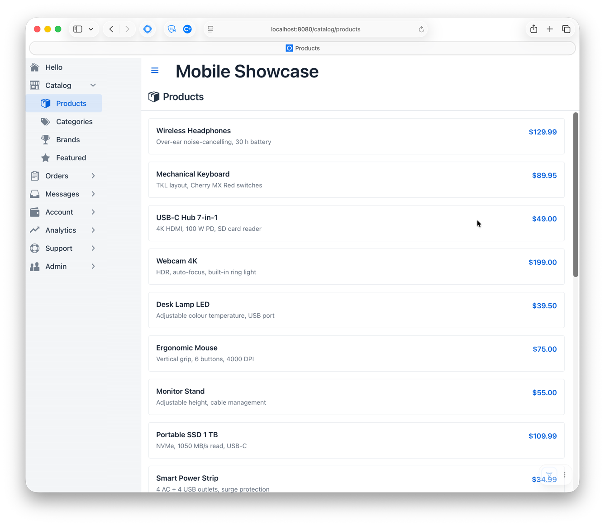<br>
<sub><b>Desktop</b> — <code>SIDENAV</code> drawer</sub>
</td>
</tr>
<tr>
<td align="center" width="40%">
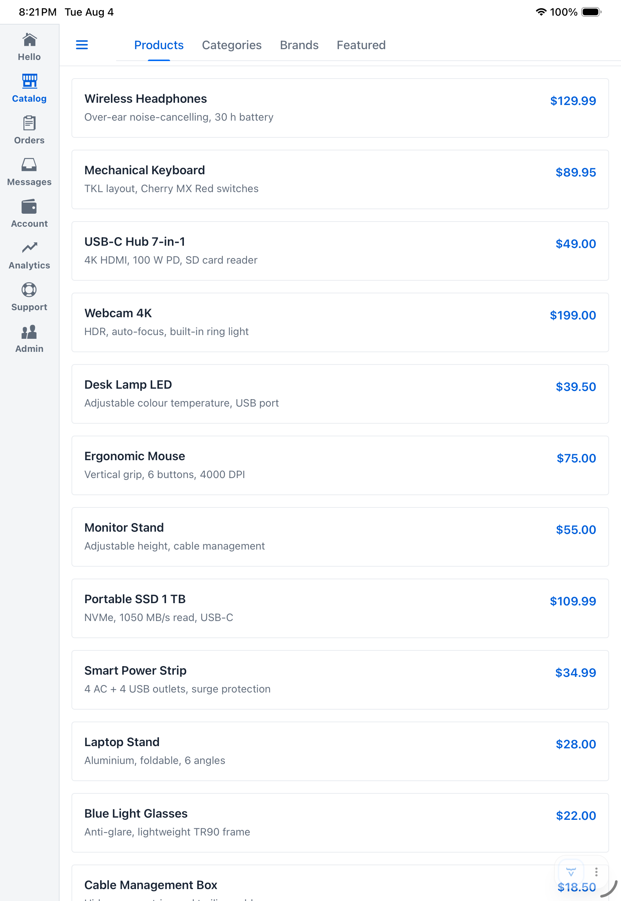<br>
<sub><b>Tablet, portrait</b> — <code>RAIL</code></sub>
</td>
<td align="center">
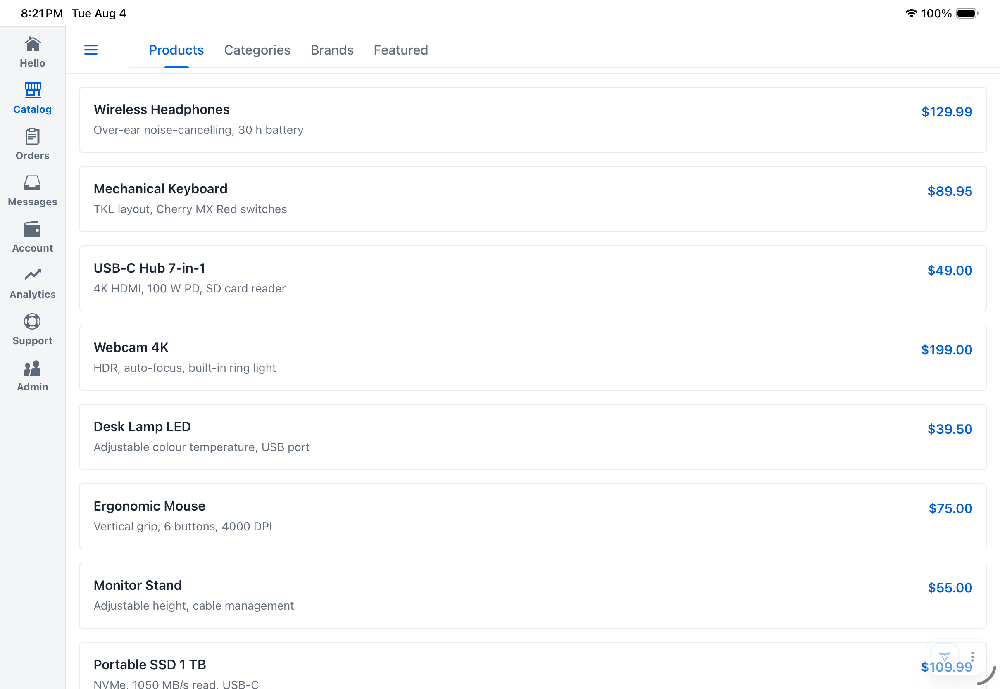<br>
<sub><b>Tablet, landscape</b> — <code>RAIL</code></sub>
</td>
</tr>
<tr>
<td align="center">
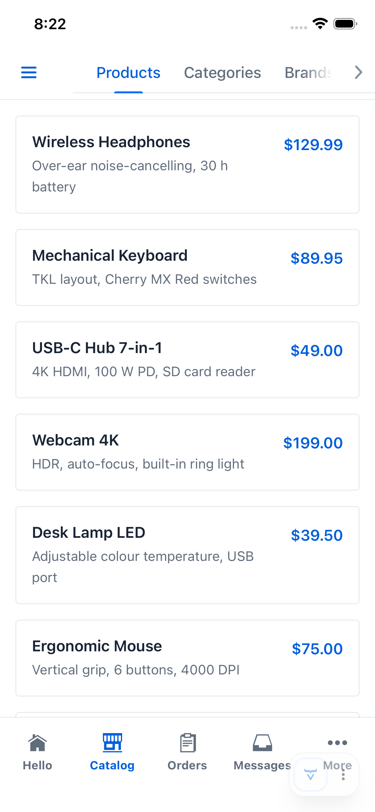<br>
<sub><b>Phone, portrait</b> — <code>TOUCH</code> bottom bar with secondary tabs, overflowing into a popover</sub>
</td>
<td align="center">
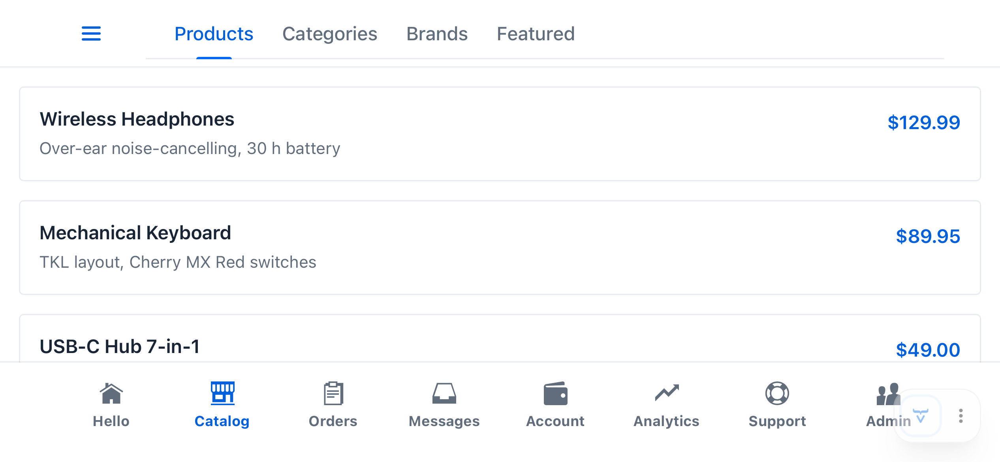<br>
<sub><b>Phone, landscape</b> — <code>TOUCH</code> bottom bar, wide enough that nothing overflows</sub>
</td>
</tr>
</table>

### Alternatives

But you aren't stuck with the default renderers. There are some alternative renderers that can be used in place of the default ones, or you can roll your own — see [Built-in alternatives for the phone touch bar](#built-in-alternatives-for-the-phone-touch-bar) for how to register the two shown below.

<table>
<tr>
<td align="center" colspan="2">
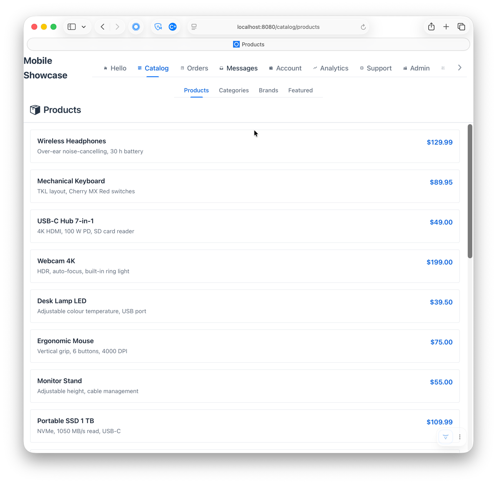<br>
<sub><b>Desktop</b> — <code>SIDENAV</code> drawer</sub>
</td>
</tr>
<tr>
<td align="center" width="40%">
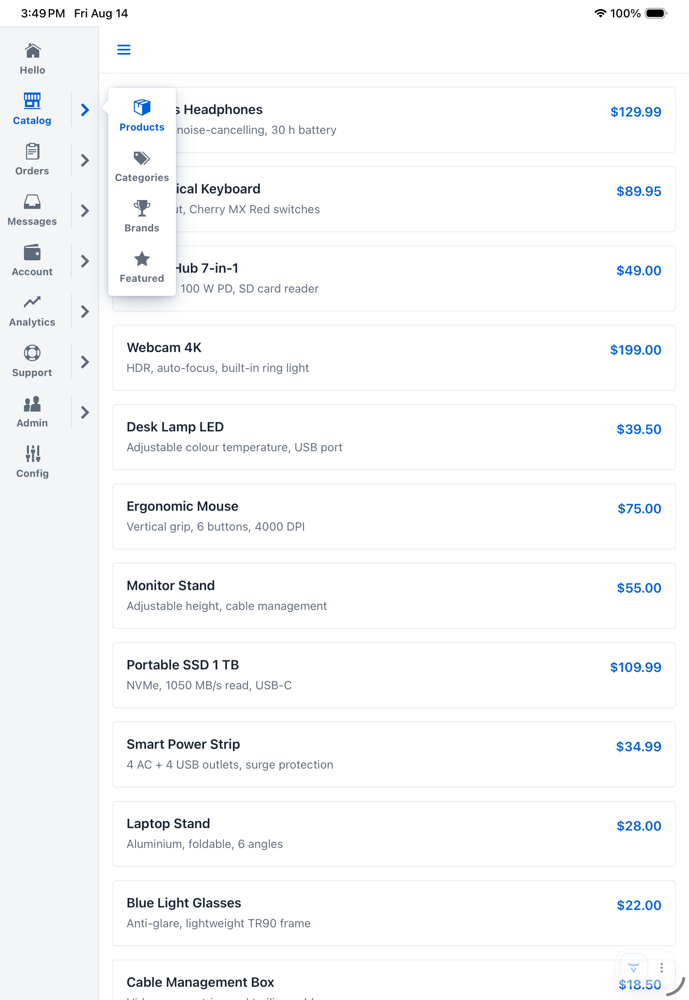<br>
<sub><b>Tablet, portrait</b> — <code>RAIL</code></sub>
</td>
<td align="center">
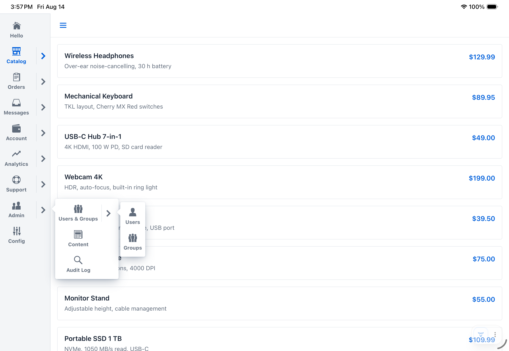<br>
<sub><b>Tablet, landscape</b> — <code>RAIL</code></sub>
</td>
</tr>
<tr>
<td align="center">
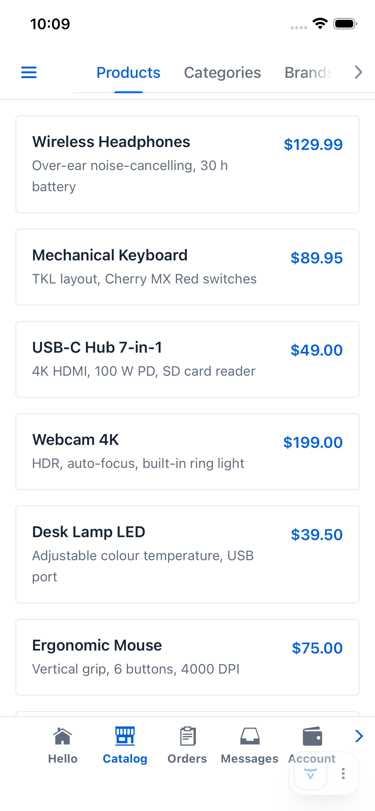<br>
<sub><b>Phone, portrait</b> — <code>TOUCH</code> bottom bar with secondary tabs, overflowing into a side-to-side scroller (unscrolled)</sub>
</td>
<td align="center">
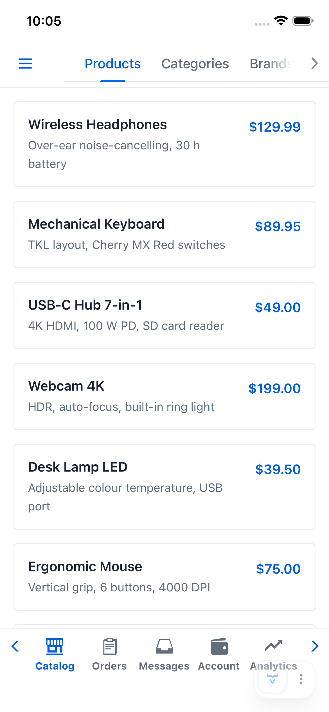<br>
<sub><b>Phone, portrait</b> — <code>TOUCH</code> bottom bar with secondary tabs, overflowing into a side-to-side scroller (scrolled)</sub>
</td>
</tr>
<tr>
<td align="center">
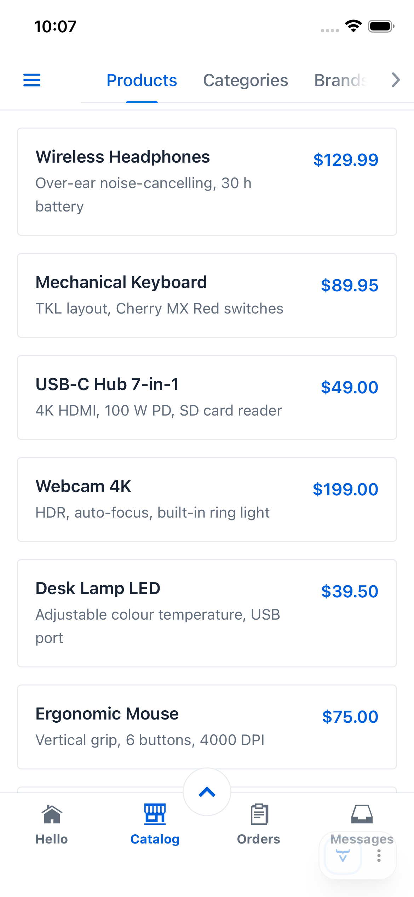<br>
<sub><b>Phone, portrait</b> — <code>TOUCH</code> bottom bar with secondary tabs, overflowing into an expander (collapsed)</sub>
</td>
<td align="center">
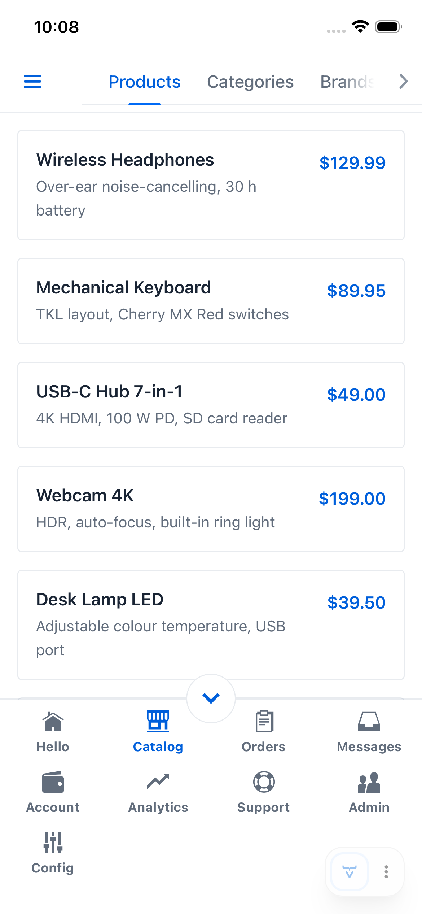<br>
<sub><b>Phone, portrait</b> — <code>TOUCH</code> bottom bar with secondary tabs, overflowing into an expander (expanded)</sub>
</td>
</tr>
</table>

## How it works

`AppNavLayout` extends Vaadin's `AppLayout` and uses its standard `navbar-bottom` slot for both the touch bar and the rail. `RAIL` mode repositions and restyles it via CSS keyed on a `nav-rail` attribute `AppNavLayout` sets on itself. Because it's the standard `AppLayout` slot and not a bespoke part, any other component that already understands `AppLayout`'s own `navbar-top`/`navbar-bottom` contract interoperates with rail mode automatically, with no special-casing needed on its part.

`AppNavLayout` builds one nav tree from your routes, then hands that same tree to a different renderer depending on the device. The tree itself — a graph of `NavNode`s built by whichever `NavGrouper` is configured — has no idea what device it'll be shown on; the two decisions are made independently and only combined at render time. That's what lets a `SideNav` drawer, a touch bottom bar, and a side rail all stay in sync with the same routes without three separate components to maintain.

`AppNavLayout` distinguishes five device/orientation scenarios (desktop, tablet portrait, tablet landscape, phone portrait, phone landscape), each with its own configurable `NavRenderer`. On attach, it reads touch capability and screen size to resolve the current scenario, which determines both the `NavRenderer` and the `NavType` it declares (`SIDENAV`, `RAIL`, `TOUCH`, or `HEADER`) — `SIDENAV` builds a `DesktopNavStrategy` (a full `SideNav` in the drawer), `RAIL`/`TOUCH` build a `TouchNavStrategy` (an icon bar or rail, plus a two-level drill-down header for nested routes), `HEADER` builds a `HeaderNavStrategy` (a tab strip spanning the header, alongside brand/user content, plus the same two-level drill-down beneath it). A `Signal.effect` on the window size re-evaluates this on every rotation or resize, swapping chrome in place with no page reload — though if the newly-resolved scenario still points at the same `NavRenderer` instance as before (tablet's two orientations share one by default), nothing tears down and rebuilds; only the item count/layout inside that renderer adjusts.

See [Nav renderers](#nav-renderers) for configuring each of these pieces, and [API Reference](#api-reference) for the full `NavRenderer`/`NavStrategy`/`NavType` picture.

## Feature list

### Automatic

- **Device-adaptive nav chrome** — a bottom touch bar on phones, a permanent side rail on tablets (both orientations), and a `SideNav` drawer on desktop, switched to automatically based on touch capability and screen size.
- **Live re-evaluation** — rotating a device, resizing a split-screen window, or any other viewport change re-picks the right nav type in place, with no page reload.
- **Nav tree derived from your routes** — the entire nav tree comes from the `@Route`/`@Menu` metadata your views already declare; add, move, or rename a view and every nav surface (bar, rail, drawer) picks it up with no separate wiring.
- **Automatic grouping** — sibling routes sharing a first path segment (e.g. `catalog/products`, `catalog/categories`) are grouped under an auto-labeled section with no group annotation of their own.
- **Overflow handling** — when more root sections exist than fit a touch bar or rail, the excess collapses into a "More" popover automatically.
- **Drill-down secondary nav** — nested routes get a two-level tab bar with a back button on touch/rail, kept in sync with the current route.
- **Active-item highlighting** — the current route's nav item is highlighted consistently across all three nav types.
- **Adaptive per-view header** — a view can contribute an icon+title (desktop) or an action component (desktop and mobile) to a header slot that reassembles itself on every navigation, via `HasViewHeaderTitle`/`HasViewHeaderComponent`.
- **Theme-adaptive styling** — active nav items pick up whichever Vaadin theme is actually loaded (Lumo, Aura, or a properly authored custom theme) automatically, rather than a hardcoded color.
- **Safe-area aware** — bar/rail icon capacity accounts for device notches, rounded corners, and home indicators, so nothing renders under an unsafe strip.

### Customizable

- **Custom icon/title/grouping** — drive labels, icons, and grouping from your own annotations instead of `@Menu`, via `setViewIconGenerator`/`setViewTitleGenerator`/`setViewNavGroupResolver`.
- **Custom grouping strategy** — replace `PathPrefixNavGrouper` entirely with your own `NavGrouper`.
- **Custom active-item matching** — override path matching for touch/rail highlighting (`setNavPathMatcher`), or nested-route match behavior for desktop `SideNav` highlighting (`setNavMatchNested`).
- **Per-scenario renderers** — independently swap the `NavRenderer` for any of the five device/orientation scenarios, or set both orientations of tablet/phone at once.
- **Partial overrides** — subclass a built-in renderer to change just one behavior, e.g. override `createOverflowComponent()` to replace the "More" popover with your own presentation.
- **Built-in phone touch bar alternatives** — `ScrollingTouchNavRenderer`/`ExpandingTouchNavRenderer` ship two ready-made, fully separate renderers for the phone scenario, each with its own overflow presentation (a scrolling strip, an expanding grid) — no subclassing required.
- **Built-in tablet rail alternative** — `FlyoutRailNavRenderer` ships a chevron-and-flyout presentation for nested groups, in place of the shared drill-down bar.
- **Built-in header tab strip alternative** — `HeaderTabsNavRenderer` ships a `Tabs` strip spanning the header in place of a drawer, rail, or bottom bar, for any scenario.
- **Custom `SideNavItem` rendering** — override `setNavNodeRenderer` for full control of the desktop drawer's item appearance.
- **Configurable breakpoint** — adjust the physical-screen-size threshold that distinguishes tablet from phone (`setTabletMinShortSidePx`).
- **Lifecycle hook** — react to nav-type changes via `onNavTypeChanged`/`NavTypeChangedEvent`.
- **Escape hatch** — `addToNavbar()` for direct `AppLayout` access when nothing else fits.

## API Reference

Every public and protected member of the library, for lookup. All `AppNavLayout` configuration setters take effect immediately, even after the component is attached.

### `AppNavLayout`

Constructors (protected — called via `super(...)` from a subclass):

| Constructor      | Description                           |
|------------------|----------------------------------------|
| `AppNavLayout()` | Default renderers for every scenario. |

Configuration setters (protected — call from the subclass constructor or later):

| Method                                                        | Default                | Description                                                                                                                                                                        |
|---------------------------------------------------------------|------------------------|------------------------------------------------------------------------------------------------------------------------------------------------------------------------------------|
| `addBranding(Component...)`                                    | —                      | Logo/title: header (desktop) or drawer top (mobile). Pass individual components, not pre-wrapped.                                                                                  |
| `setUserMenu(Component)`                                      | —                      | User widget: header trailing (desktop) or drawer bottom (mobile).                                                                                                                  |
| `setNavPathMatcher(BiPredicate<String, String>)`              | `String::equals`       | Active-item path matching for touch/rail highlighting only — desktop `SideNav` highlights via Vaadin's own router matching.                                                        |
| `setNavMatchNested(boolean)`                                  | `false`                | Whether desktop `SideNavItem`s use `setMatchNested`, so a parent stays highlighted while any child route is active.                                                                |
| `setNavGrouper(NavGrouper)`                                   | `PathPrefixNavGrouper` | Full grouping strategy override. **Severs** the automatic wiring to `setViewNavGroupResolver`/`setViewIconGenerator` — configure a custom grouper directly before passing it here. |
| `setNavNodeRenderer(ComponentRenderer<SideNavItem, NavNode>)` | built-in               | Custom desktop `SideNavItem` renderer.                                                                                                                                             |
| `setViewNavGroupResolver(Function<MenuEntry, NavGroup>)`      | path-based (`null`)    | Explicit group assignment for a view; return `null` for path-based grouping. Only takes effect through the default `PathPrefixNavGrouper`.                                         |
| `setViewIconGenerator(Function<MenuEntry, Supplier<Icon>>)`   | no icon                | Icon for each leaf nav item. Only takes effect through the default `PathPrefixNavGrouper`.                                                                                         |
| `setViewTitleGenerator(Function<MenuEntry, String>)`          | `@Menu#title()`        | Label for desktop `SideNavItem`s only — touch/rail labels always use `NavNode.title()`.                                                                                            |

`NavRenderer` setters (protected — call from the subclass constructor or later): each takes a
`Supplier<NavRenderer>`, invoked at most once — the first time that scenario is actually needed,
not eagerly. If the scenario is currently active, it's torn down and rebuilt immediately.

| Method                                                 | Default                          | Description                                                                                                                                                                                                                                |
|--------------------------------------------------------|----------------------------------|--------------------------------------------------------------------------------------------------------------------------------------------------------------------------------------------------------------------------------------------|
| `setDesktopNavRenderer(Supplier<NavRenderer>)`         | `SideNavDrawerNavRenderer::new`  | Renderer for the desktop scenario.                                                                                                                                                                                                         |
| `setTabletPortraitNavRenderer(Supplier<NavRenderer>)`  | `SideRailNavRenderer::new`       | Renderer for the portrait-tablet scenario.                                                                                                                                                                                                 |
| `setTabletLandscapeNavRenderer(Supplier<NavRenderer>)` | same instance as portrait-tablet | Renderer for the landscape-tablet scenario.                                                                                                                                                                                                |
| `setTabletNavRenderer(Supplier<NavRenderer>)`          | —                                | Convenience: sets both tablet orientations to one shared, memoized instance. Both orientations get that renderer's own chrome (its `navType()`), so e.g. supplying `SideRailNavRenderer` correctly gives rail chrome in both orientations. |
| `setPhonePortraitNavRenderer(Supplier<NavRenderer>)`   | `TouchBarNavRenderer::new`       | Renderer for the portrait-phone scenario.                                                                                                                                                                                                  |
| `setPhoneLandscapeNavRenderer(Supplier<NavRenderer>)`  | same instance as portrait-phone  | Renderer for the landscape-phone scenario.                                                                                                                                                                                                 |
| `setPhoneNavRenderer(Supplier<NavRenderer>)`           | —                                | Convenience: sets both phone orientations to one shared, memoized instance — the correct default relationship for phone, since both orientations already resolve to the same `NavType` and slot.                                           |

Public fluent setters (each returns `this`):

| Method                            | Default | Description                                                                                                                                                                                                                     |
|-----------------------------------|---------|---------------------------------------------------------------------------------------------------------------------------------------------------------------------------------------------------------------------------------|
| `setTabletMinShortSidePx(int px)` | `768`   | Physical-screen-shorter-side threshold (CSS px) distinguishing `TABLET` from `PHONE` among touch devices. Re-evaluates device type and nav type immediately if already attached. Throws `IllegalArgumentException` if negative. |

Lifecycle hooks and events:

| Member                                                                   | Description                                                                                                                                                                                                                                                  |
|--------------------------------------------------------------------------|--------------------------------------------------------------------------------------------------------------------------------------------------------------------------------------------------------------------------------------------------------------|
| `onNavTypeChanged(NavTypeChangedEvent event)`                            | Protected, no-op by default. Override to react to nav-type determination, including the first attachment.                                                                                                                                                    |
| `addNavTypeChangedListener(ComponentEventListener<NavTypeChangedEvent>)` | Public, returns a `Registration`. For non-subclass consumers of the same event.                                                                                                                                                                              |
| `afterNavigation(AfterNavigationEvent event)`                            | Public, from `AfterNavigationObserver`. Rebuilds the adaptive view header from the current view's `HasViewHeaderTitle`/`HasViewHeaderComponent`, and re-invokes the active `NavRenderer`(s) so active-item highlighting and drill-down content stay current. |

Accessors and escape hatch:

| Member                      | Description                                                                                                                                                                                           |
|-----------------------------|-------------------------------------------------------------------------------------------------------------------------------------------------------------------------------------------------------|
| `isMobile()`                | Protected. `true` for touch/rail nav, `false` for desktop `SIDENAV` — and `false` before the first `onAttach()` completes (device detection isn't ready yet). Don't call from a subclass constructor. |
| `addToNavbar(Component...)` | Public, overrides `AppLayout`. Appends directly to the top bar row; prefer the named adaptive methods above.                                                                                          |

### `NavTypeChangedEvent`

Fired whenever `AppNavLayout` determines and applies a `NavType`, including on first attachment.

| Constructor                                                                          | Description |
|---------------------------------------------------------------------------------------|-------------|
| `NavTypeChangedEvent(AppNavLayout source, NavType navType, NavType previousNavType)` | Public.     |

| Method                   | Description                                                       |
|--------------------------|-------------------------------------------------------------------|
| `getNavType()`           | The newly applied nav type.                                       |
| `getPreviousNavType()`   | The previously active nav type, or `null` on first attachment.    |
| `isInitialApplication()` | `true` if this is the first nav type ever applied to this layout. |

### `NavRenderer`

Builds and updates the nav-item content for one of the five device/orientation scenarios
(desktop, tablet portrait, tablet landscape, phone portrait, phone landscape), placing it into
whichever of `AppNavLayout`'s named locations (see `NavSlots`) is appropriate. Deliberately
decoupled from nav organization: a renderer receives an already-configured `NavGrouper` and
never influences or queries how the tree is grouped.

| Method                             | Description                                                                                                                                                                                                                                                                                                                                                                                               |
|------------------------------------|-----------------------------------------------------------------------------------------------------------------------------------------------------------------------------------------------------------------------------------------------------------------------------------------------------------------------------------------------------------------------------------------------------------|
| `render(NavRenderContext context)` | Builds or updates this renderer's content for the current nav state. Called once when this scenario becomes active, again on every completed navigation, and again whenever nav configuration changes (grouper swap, path matcher change). Decides which slot(s) to populate and how — including any overflow/drill-down scaffolding it needs (a "More…" popover, a chevron, a swipeable container, etc). |
| `navType()`                        | The chrome this renderer requires (`SIDENAV`, `RAIL`, `TOUCH`, or `HEADER`) — determines which `NavStrategy` gets built for whichever scenario this renderer is configured for. Not a free choice: a renderer's `render()` already assumes one specific `NavSlots` accessor is live, and that slot is only live under the matching `NavType`'s strategy.                                                            |
| `railWidth()`                       | Default `"5rem"`. Consulted only when `navType()` is `RAIL` — the rail's own width as a CSS length. Override when a renderer's items need more (or less) horizontal room than the built-ins' icon+label content alone, e.g. `FlyoutRailNavRenderer`'s own trailing chevron box.                                                                                                                          |

### `NavRenderContext`

Passed to `NavRenderer.render(...)`.

| Method             | Description                                                                                                                                                                                                        |
|--------------------|----------------------------------------------------------------------------------------------------------------------------------------------------------------------------------------------------------------|
| `navGrouper()`     | The current nav grouping strategy.                                                                                                                                                                                |
| `currentPath()`    | The path of the currently active navigation, leading `/` stripped.                                                                                                                                               |
| `slots()`          | The full set of named locations available to render into.                                                                                                                                                        |
| `navPathMatcher()` | The configured `setNavPathMatcher` predicate. A renderer that compares paths itself for active-item matching should test against this rather than hardcoding its own comparison, or `setNavPathMatcher` silently won't affect it. |

### `NavSlots`

`AppNavLayout`'s whole shape, exposed identically to every renderer regardless of scenario — a
renderer sees all five locations and decides for itself which are relevant to it.

| Method        | Description                                                                                                                                                              |
|---------------|--------------------------------------------------------------------------------------------------------------------------------------------------------------------------|
| `drawer()`    | Desktop nav location, inside the drawer.                                                                                                                                 |
| `sideRail()`  | Tablet nav location (both orientations), the left-edge rail.                                                                                                             |
| `touchBar()`  | Phone nav location, the bottom bar.                                                                                                                                      |
| `headerNav()` | Shared drill-down location for nested routes, alongside `sideRail()`/`touchBar()`, or beneath `tabStrip()`'s own row under `HEADER`. Distinct from the per-view header slot (see [View header title](#view-header-title)). |
| `tabStrip()`  | Header nav location, a primary tab strip spanning the header alongside brand/user content.                                                                              |

### `SideNavDrawerNavRenderer`

Default `NavRenderer` for the desktop scenario — builds a full `SideNav` hierarchy into
`NavSlots.drawer()`, honoring `setNavNodeRenderer`/`setNavMatchNested`. Public no-arg constructor.

### `SideRailNavRenderer` / `TouchBarNavRenderer`

Default `NavRenderer`s for the tablet (both orientations) and phone scenarios respectively: a
primary icon bar (rail or bottom bar) with a "More" overflow `Popover` when more root sections
exist than fit, plus a shared two-level drill-down bar in `NavSlots.headerNav()` — the same
drill-down bar every built-in touch/rail renderer uses, including `ScrollingTouchNavRenderer`/
`ExpandingTouchNavRenderer` below. Both public, no-arg constructors, sharing their implementation
internally.

| Method                                                                                                                      | Description                                                                                                                                                                                                                                                                                                                                                                       |
|-----------------------------------------------------------------------------------------------------------------------------|-----------------------------------------------------------------------------------------------------------------------------------------------------------------------------------------------------------------------------------------------------------------------------------------------------------------------------------------------------------------------------------|
| `createOverflowComponent(List<MenuEntry> overflowEntries, Button overflowTrigger, Map<NavNode, Button> overflowButtonsOut)` | Protected. Default: a `Popover` listing the overflowing entries. Override in a subclass to replace it with a different presentation shown in response to tapping the "More" trigger (e.g. a `Dialog`) while keeping bar layout, active highlighting, and header-nav delegation unchanged. Populate `overflowButtonsOut` the same way if the "More" item should highlight while one of its entries is active. |
| `createNavButton(Component content, Class<? extends Component> viewClass)`                                                 | Protected. Builds the themed nav-bar `Button` wrapping `content`, navigating to `viewClass` on click (or doing nothing if `null`). Reuse this from a `createOverflowComponent` override that still wants per-entry buttons, rather than constructing a `Button` directly, to keep the active item's theme-adaptive accent color.                                                 |

### `ScrollingTouchNavRenderer`

Alternative `NavRenderer` for the phone scenario: every root section gets its own item in a
horizontally scrollable bar, with fading edge chevrons instead of the default "More" popover —
when there are more sections than fit, the bar scrolls instead of overflowing into a secondary
surface. Same shared drill-down bar as the other touch/rail renderers. Public, no-arg constructor.

### `ExpandingTouchNavRenderer`

Alternative `NavRenderer` for the phone scenario: root sections in a grid that expands upward via
a chevron when there are more than fit, instead of the default "More" popover. The primary row
always shows a fixed, even number of items; the rest sit in a collapsible section beneath it.
Same shared drill-down bar as the other touch/rail renderers. Public, no-arg constructor.

### `FlyoutRailNavRenderer`

Alternative `NavRenderer` for the tablet scenario: every rail item that represents a nav group
gets a right-pointing chevron instead of navigating to a representative child; tapping it pops up
a flyout listing that group's own children, recursively, to whatever depth the route hierarchy
actually goes. Unlike every other built-in touch/rail renderer, never touches
`NavSlots.headerNav()` — the flyout cascade reaches every level of the tree directly, so the
shared drill-down bar has nothing left to show. Public, no-arg constructor.

### `HeaderTabsNavRenderer`

Alternative `NavRenderer` for `NavType.HEADER`: root sections render as a `Tabs` strip in
`NavSlots.tabStrip()`, spanning the header alongside brand/user content, instead of a drawer,
rail, or bottom bar. Selecting a leaf navigates directly; selecting a group only reveals that
root's own children in the same shared drill-down bar every other touch/rail renderer uses, via
`NavSlots.headerNav()` — it never navigates on its own, at either level, and losing focus on the
whole nav hierarchy without ever landing on a leaf restores both rows to the real current view.
Public, no-arg constructor.

### `NavGrouper` (`@FunctionalInterface`)

| Member                             | Description                                                                                                                                                                                                                                          |
|------------------------------------|------------------------------------------------------------------------------------------------------------------------------------------------------------------------------------------------------------------------------------------------------|
| `NavNode nodeFor(MenuEntry entry)` | Maps a route entry to its `NavNode` in the nav tree. **Must be idempotent** — called on both the initial build and every subsequent navigation, so implementations must not mutate state on first call. Call order across entries is not guaranteed. |
| `default void reset()`             | No-op by default. Clears cached state so the next `nodeFor` calls start fresh.                                                                                                                                                                       |

### `PathPrefixNavGrouper` (the default `NavGrouper`)

Derives the nav hierarchy from `@Route` path segments.

| Method                                                      | Description                                                                                                                                                                                      |
|-------------------------------------------------------------|--------------------------------------------------------------------------------------------------------------------------------------------------------------------------------------------------|
| `setNavGroupDefResolver(Function<MenuEntry, NavGroup>)`     | Returns `this`. Maps an entry to explicit `NavGroup` metadata; return `null` to fall back to path-based grouping.                                                                                |
| `setViewIconGenerator(Function<MenuEntry, Supplier<Icon>>)` | Returns `this`. Icon generator for leaf nodes; default is no icon.                                                                                                                               |
| `reset()`                                                   | Clears all cached group/leaf nodes.                                                                                                                                                              |
| `nodeFor(MenuEntry)`                                        | Path-based grouping: entries sharing a first path segment share a group, auto-labeled from that segment (`RouteNavUtils.routeSegmentLabel`) unless a `NavGroup` resolver assigns one explicitly. |

### `NavGroup`

Implement to declare explicit group metadata (title/icon/parent), paired with `AppNavLayout.setViewNavGroupResolver`.

| Method     | Description                                                                                                                                                                   |
|------------|-------------------------------------------------------------------------------------------------------------------------------------------------------------------------------|
| `title()`  | Display title for this group node.                                                                                                                                            |
| `icon()`   | Returns a `Supplier<Icon>` for the group icon, or `null` for none. Each invocation must produce a **new** `Icon` instance — a cached instance gets silently moved on rebuild. |
| `parent()` | The parent group, or `null` for a root group.                                                                                                                                 |

### `NavNode`

Immutable nav-tree node — a group (no `menuEntry()`) or a leaf (`menuEntry()` present).

| Method                                                                            | Description                                                                              |
|-----------------------------------------------------------------------------------|------------------------------------------------------------------------------------------|
| `static NavNode of(String title, Supplier<Icon> iconSupplier)`                    | Root group node.                                                                         |
| `static NavNode of(String title, Supplier<Icon> iconSupplier, NavNode parent)`    | Group node nested under `parent`.                                                        |
| `static NavNode of(MenuEntry entry)`                                              | Root leaf node; icon from `@Menu(icon=...)`.                                             |
| `static NavNode of(MenuEntry entry, Supplier<Icon> iconOverride)`                 | Root leaf node; `iconOverride` wins over `@Menu(icon=...)` if non-null.                  |
| `static NavNode of(MenuEntry entry, NavNode parent)`                              | Leaf node nested under `parent`; icon from `@Menu(icon=...)`.                            |
| `static NavNode of(MenuEntry entry, Supplier<Icon> iconOverride, NavNode parent)` | Leaf node nested under `parent`; `iconOverride` wins over `@Menu(icon=...)` if non-null. |
| `title()`                                                                         | Display title for this node.                                                             |
| `createIcon()`                                                                    | Returns a fresh `Optional<Icon>` — a new instance on every call; never cache the result. |
| `parent()`                                                                        | `Optional<NavNode>` — empty for top-level nodes.                                         |
| `menuEntry()`                                                                     | `Optional<MenuEntry>` — present for leaves, empty for groups.                            |

### `RouteNavUtils`

Stateless static helpers.

| Method                              | Description                                                                                                                  |
|-------------------------------------|------------------------------------------------------------------------------------------------------------------------------|
| `pathSegments(String routePath)`    | Path segments as an immutable list; empty path (e.g. root `""`) returns `List.of()`, not a list containing one empty string. |
| `normalizedPath(MenuEntry entry)`   | `entry.path()` with any leading `/` stripped.                                                                                |
| `routeSegmentLabel(String segment)` | Capitalizes each hyphen-delimited word, e.g. `"audit-log"` → `"Audit Log"`.                                                  |
| `leafTitle(MenuEntry entry)`        | `entry.title()` as-is — already resolved by `MenuConfiguration.getMenuEntries()` (`@Menu` title, falling back to `@PageTitle`, then the class name); adds no fallback of its own. |

### `NavType`, `DeviceType`, `Orientation` (enums)

| Type          | Constants                                                                                                                                                                                                      |
|---------------|----------------------------------------------------------------------------------------------------------------------------------------------------------------------------------------------------------------|
| `NavType`     | `TOUCH` — touch bottom bar + secondary tabs. `RAIL` — permanent left-strip icon rail. `SIDENAV` — drawer-based `SideNav`. `HEADER` — header tab strip + drill-down row. Declared by the active scenario's `NavRenderer.navType()`, not chosen independently. |
| `DeviceType`  | `PHONE`, `TABLET`, `DESKTOP` — detected from touch capability and screen size. Defaults to `DESKTOP` before the async client round-trip completes, and for any non-touch device.                               |
| `Orientation` | `PORTRAIT`, `LANDSCAPE` — re-evaluated on window resize for touch devices. Defaults to `LANDSCAPE` before the client round-trip completes.                                                                     |

### `HasViewHeaderTitle`

Implement on a view to contribute an auto-generated icon+title component to the adaptive header (desktop only).

| Method                                    | Description                                                                                                                                                             |
|-------------------------------------------|-------------------------------------------------------------------------------------------------------------------------------------------------------------------------|
| `default Component getViewHeaderSuffix()` | `null` by default. Trailing component after the title (e.g. a badge); return a new instance on every navigation.                                                        |
| `default Icon getViewHeaderIcon()`        | `null` by default. Must return a **new** `Icon` instance on every call — a cached one gets silently moved on each navigation.                                           |
| `default Component getViewHeaderTitle()`  | Composes icon + `@PageTitle` + suffix into the header title component; called on every navigation. Override to replace it entirely; return `null` to suppress the slot. |

### `HasViewHeaderComponent`

Implement on a view to contribute an action component to the adaptive header (both desktop and mobile).

| Method                               | Description                                                                                                                                                 |
|--------------------------------------|-------------------------------------------------------------------------------------------------------------------------------------------------------------|
| `Component getViewHeaderComponent()` | Called on every navigation. Return `null` to suppress the slot; return the same instance if it's already attached elsewhere, otherwise a new one each call. |

## Add-On development

### Running the demo

```
mvn jetty:run
```

Starts the test/demo server at http://localhost:8080.

### Integration tests

```
mvn verify -Pit
```

Tests run in headless mode by default. To disable headless mode:

```
mvn verify -Pit -Dplaywright.headed=true
```

## Publishing to Vaadin Directory

You can create the zip package needed for [Vaadin Directory](https://vaadin.com/directory/) using

```
mvn versions:set -DnewVersion=1.0.0 # You cannot publish snapshot versions
mvn clean install -Pdirectory
```

The package is created as `target/{project-name}-1.0.0.zip`

For more information or to upload the package, visit https://vaadin.com/directory/my-components?uploadNewComponent
